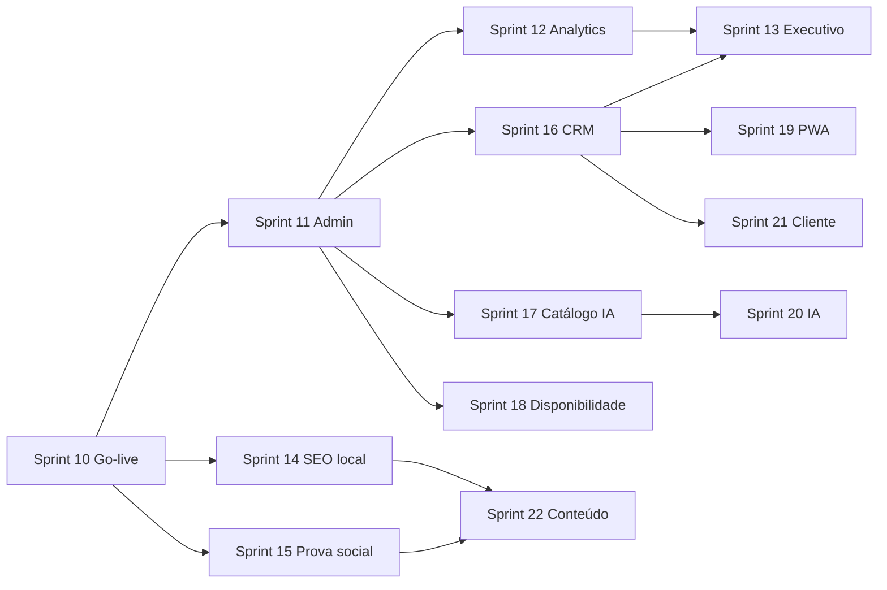

# Roadmap — Landing Page & Plataforma de Locação de Equipamentos

> **Arquivo temporário** — planejamento interno. Pode ser removido ou movido para `/docs` após validação com stakeholders.
>
> **Projeto:** Site institucional + conversão (leads) para empresa de locação de equipamentos aéreos e de construção (máquinas, betoneiras, marteletes, compactadores, etc.)
>
> **Stack base:** Next.js 16 (App Router), TypeScript, Tailwind CSS, next-intl, Drizzle ORM, PostgreSQL/PGlite, Zod, React Hook Form.
>
> **Última atualização:** 2026-05-20 (§4.0 carrinho vs SSR/hydration; Casos de Sucesso na Home; SEO primeiro frame; Clerk pk_live)
>
> ### Status rápido (implementado no código)
> | Sprint | Status |
> |--------|--------|
> | 0–4 | ✅ Catálogo base 110 itens, home, sobre, contato, FAQ, busca, CTAs, depoimentos, treinamento, **relacionados no detalhe** |
> | 5 | ✅ Formulário + leads + Resend + **carrinho multi-item** + **`items_json`** + **orçamento via WhatsApp** (e-mail interno) |
> | 6 | ✅ JSON-LD, Privacidade, OG, robots preview noindex (cookie banner ⏳ se PostHog) |
> | 7 | 🟡 Parcial (CTA hierarquia ✅; a11y, skeleton, PageSpeed alvo ⏳) |
> | **7.9** | 📋 **Planejado** — Docker Compose (app, db, studio por serviço) |
> | 8 | ✅ Preview · E2E · sign-off **Flaviano** (2026-05-19) — ver `docs/SPRINT-8-STATUS.md` |
> | 9 | 🟡 **Parcial** — fotos ~125/148; **38 acessórios**; specs plataformas revisadas; cases/logos → **Sprint 15** |
> | 10 | ⏳ Domínio oficial + go-live (`acessoequipamentos.com.br`) |
> | **11** | 📋 **Planejado** — Admin operacional (CRUD, leads, CSV, tracking básico) |
> | **12–13** | 📋 **Planejado** — Analytics comercial avançado + dashboard executivo |
> | **14–15** | 📋 **Planejado** — SEO programático + prova social |
> | **16–18** | 📋 **Planejado** — CRM leve, inteligência de catálogo, disponibilidade |
> | **19–22** | 📋 **Backlog** — PWA, IA comercial, área do cliente, conteúdo técnico |
>
> ### Entregas incrementais (pós sign-off Sprint 8)
>
> | Entrega | Status | Referência |
> |---------|--------|------------|
> | Carrinho com quantidade por item | ✅ | `QuoteCartProvider`, `QuoteCartQuantityStepper` — padrão client + `useEffect` (ver [§ Carrinho vs SSR](#7-carrinho-localstorage-vs-ssr-hydration)) |
> | Lead com vários itens (`items_json`) | ✅ | `migrations/0002_leads_cart_items.sql` |
> | Orçamento: WhatsApp (cliente) + e-mail interno | ✅ | `quote-whatsapp.ts`, `QuoteForm.tsx` |
> | Shell marketing (server/client) | ✅ | `MarketingShell.tsx` (sem `MarketingClientShell`) |
> | Fotos: sync + aliases + multi-cópia (pesos) | ✅ | `sync-equipment-photos.py`, `equipment-photo-aliases.json` |
> | Nomes padronizados no catálogo | ✅ | `normalize-equipment-names.py` |
> | Specs 14 plataformas aéreas corrigidas | ✅ | `fix-platform-specs.py`, `equipamentos.json` |
> | Categoria **acessorios** (38 itens) | ✅ | `seed-acessorios.py` — 34 com foto |
> | Deploy Vercel `main` | ✅ | `landing-page-acesso.vercel.app` — commit `73ad35b`+ |
>
> **Fotos:** ~144/148 no manifest (2026-05-20). **Sem foto (futuro):** `maleta`, `pinca-para-maquina-de-solda`, `bateria`, `carregador`, `rodape-de-0-20-x-3-00-m` (+ alias `tranformador` quando houver `transformador.jpg`).

---

## Índice

1. [Visão e objetivos](#1-visão-e-objetivos)
2. [Princípios de arquitetura](#2-princípios-de-arquitetura)
3. [Fases do produto](#3-fases-do-produto)
4. [Roadmap por sprint (detalhado)](#4-roadmap-por-sprint-detalhado)
4.0. [⚠️ Pontos de atenção — próximas sprints](#️-pontos-de-atenção--próximas-sprints)
4.0.1. [Casos de Sucesso — logos na Home (prioridade alta)](#casos-de-sucesso--logos-de-clientes-na-home-prioridade-alta)
4.0.2. [Carrinho `localStorage` vs SSR / hydration](#7-carrinho-localstorage-vs-ssr-hydration)
4.1. [Sprint 7.9 — Docker e ambiente local](#sprint-79--docker-e-ambiente-local)
4.2. [Sprint 11 — Painel administrativo (operação)](#sprint-11--painel-administrativo-operação-fase-2)
4.3. [Sprint 12 — Analytics comercial avançado](#sprint-12--analytics-comercial-avançado)
4.4. [Sprint 13 — Dashboard executivo](#sprint-13--dashboard-executivo)
4.5. [Sprint 14 — SEO programático pesado](#sprint-14--seo-programático-pesado)
4.6. [Sprint 15 — Sistema de prova social](#sprint-15--sistema-de-prova-social)
4.7. [Sprint 16 — CRM leve interno](#sprint-16--crm-leve-interno)
4.8. [Sprint 17 — Inteligência de catálogo](#sprint-17--inteligência-de-catálogo)
4.9. [Sprint 18 — Disponibilidade operacional](#sprint-18--disponibilidade-operacional)
4.10. [Sprint 19 — PWA / app comercial](#sprint-19--pwa--app-comercial)
4.11. [Sprint 20 — IA comercial](#sprint-20--ia-comercial)
4.12. [Sprint 21 — Área do cliente](#sprint-21--área-do-cliente)
4.13. [Sprint 22 — Conteúdo técnico / autoridade](#sprint-22--conteúdo-técnico--autoridade)
5. [Estrutura de páginas e rotas](#5-estrutura-de-páginas-e-rotas)
6. [Modelo de dados](#6-modelo-de-dados)
7. [Design system e UX](#7-design-system-e-ux)
8. [SEO, performance e acessibilidade](#8-seo-performance-e-acessibilidade)
9. [Integrações e operações](#9-integrações-e-operações)
10. [Qualidade, testes e deploy](#10-qualidade-testes-e-deploy)
11. [Riscos e mitigações](#11-riscos-e-mitigações)
12. [Critérios de pronto (Definition of Done)](#12-critérios-de-pronto-definition-of-done)
13. [Backlog futuro (pós-MVP)](#13-backlog-futuro-pós-mvp)
14. [Checklist de kickoff](#14-checklist-de-kickoff)

---

## 1. Visão e objetivos

### 1.1 Visão do produto

Construir uma presença digital **profissional, rápida e orientada a conversão** que apresente o catálogo de equipamentos, transmita confiança (frota real, certificações, obras atendidas) e capture **orçamentos qualificados** com o mínimo de fricção — especialmente em mobile, onde o público de obras costuma navegar.

### 1.2 Objetivos de negócio (mensuráveis)

| Objetivo | Métrica sugerida | Meta inicial (90 dias) |
|----------|------------------|------------------------|
| Gerar leads qualificados | Envios de formulário + cliques WhatsApp | Baseline + crescimento mês a mês |
| Aumentar visibilidade local | Impressões/cliques orgânicos (GSC) | Indexação de todas as páginas de equipamento |
| Reduzir tempo de resposta comercial | % leads com equipamento + período preenchidos | > 70% dos formulários completos |
| Transmitir credibilidade | Taxa de rejeição, tempo na página | < 55% rejeição na home |
| Performance técnica | LCP, INP, CLS (Core Web Vitals) | “Bom” em mobile (PageSpeed) |

### 1.3 Público-alvo

- Construtoras, empreiteiras e autônomos (pedreiros, equipes de obra).
- Responsáveis por compras/locação em obras civis, reformas e infraestrutura.
- Clientes que buscam equipamentos **aéreos** (plataformas, tesouras) e **terra/compactação** (betoneiras, marteletes, compactadores, etc.).

### 1.4 Fora de escopo (MVP / Fase 1)

- Reserva online com calendário de disponibilidade em tempo real.
- Pagamento online e assinatura digital de contrato.
- Portal do cliente com histórico de locações.
- ERP completo (faturamento, manutenção de frota, NF).
- App mobile nativo.

---

## 2. Princípios de arquitetura

### 2.1 Decisões estruturais

| Decisão | Escolha recomendada | Motivo |
|---------|---------------------|--------|
| Framework | Manter Next.js App Router | SEO, SSG/ISR, ecossistema maduro |
| Site público vs admin | Rotas separadas `(marketing)` / `(admin)` futuro | Segurança e clareza |
| Catálogo (Fase 1) | Conteúdo em `src/content/` (JSON/MDX) | Simples, versionado, rápido para lançar |
| Leads (Fase 1) | API Route + Drizzle + PostgreSQL | Persistência e relatórios básicos |
| Autenticação | Sem Clerk no MVP | Landing não exige login |
| UI | Tailwind + shadcn/ui (Radix) | Consistência e acessibilidade |
| i18n | `pt-BR` default; EN opcional depois | Mercado principal Brasil |
| Imagens | `next/image` + pasta `public/` ou CDN | Performance e LCP |

### 2.2 Estrutura de pastas alvo

```
src/
├── app/[locale]/(marketing)/       # Site público
│   ├── page.tsx
│   ├── equipamentos/
│   ├── categorias/
│   ├── orcamento/
│   ├── sobre/
│   └── contato/
├── app/api/                        # leads, webhooks
├── components/
│   ├── ui/                         # shadcn (Button, Card, Input…)
│   ├── marketing/                  # Hero, CategoryGrid, EquipmentCard
│   ├── forms/                      # QuoteForm, ContactForm
│   └── layout/                     # Header, Footer, MobileNav
├── content/
│   ├── equipamentos/*.json
│   ├── categorias.json
│   └── depoimentos.json
├── lib/
│   ├── equipment.ts                # loaders do catálogo
│   ├── leads.ts
│   └── whatsapp.ts
├── types/
│   └── equipment.ts
├── validations/
│   └── quote.ts
└── utils/
    └── AppConfig.ts
```

### 2.3 Fluxo de conversão

```
Descoberta (SEO/ads) → Home/Categoria → Lista → Detalhe do equipamento
                              ↓
              Orçamento (form) ou WhatsApp (mensagem pré-preenchida)
                              ↓
                    Lead no banco + notificação (email/CRM)
```

---

## 3. Fases do produto

### Fase 0 — Fundação (Semanas 1–2)

Preparar repositório, identidade, conteúdo mínimo e remover demos do boilerplate.

**Entregáveis:** projeto limpo, `pt-BR`, design tokens, inventário aprovado. **Sem** domínio/hospedagem oficial nesta fase.

---

### Fase 1 — MVP Landing + Catálogo + Leads (Semanas 3–8)

Site público completo para lançamento comercial.

**Entregáveis:**

- Home, categorias, listagem e detalhe de equipamentos
- Formulário de orçamento e contato
- Persistência de leads
- SEO básico, sitemap, analytics
- **Preview para aprovação do cliente** (Vercel `*.vercel.app`, sem domínio oficial)
- Deploy produção e domínio **somente após sign-off** (ver Sprint 10)

---

### Fase 2 — Consolidação e conteúdo (Semanas 9–12)

Escala de catálogo, prova social, otimizações e ferramentas para o time comercial.

**Entregáveis:**

- Catálogo expandido (30+ itens ou integração CMS)
- Páginas de confiança (obras, certificações, FAQ)
- Dashboard interno simples de leads (opcional)
- Melhorias de performance e testes E2E críticos

---

### Fase 3 — Operação digital e comercial (Trimestre 2–3)

| Faixa | Sprints | Foco |
|-------|---------|------|
| **Operação** | 11 | Admin: catálogo, leads, CSV, instrumentação básica |
| **Dados & gestão** | 12–13 | Analytics avançado, ROI comercial, dashboard executivo |
| **Aquisição** | 14–15 | SEO local em escala, prova social e confiança |
| **Vendas** | 16–17 | CRM leve, recomendações e descoberta no catálogo |
| **Frota** | 18 | Disponibilidade estimada (diferencial operacional) |
| **Escala** | 19–22 | PWA, IA, portal cliente, autoridade técnica (blog/NR) |

**Pré-requisito comum:** Sprint **10** (domínio oficial + PostHog/GA em produção).

**Entregáveis futuros (pós-Fase 3):** integração ERP (Omie), reservas online com calendário, pagamento digital.

---

## 4. Roadmap por sprint (detalhado)

> **Convenção:** sprints de 2 semanas. Ajuste datas conforme capacidade da equipe (1 dev full-stack ≈ roadmap abaixo).

---

### Sprint 0 — Kickoff e alinhamento (3–5 dias)

| ID | Tarefa | Responsável | Saída |
|----|--------|-------------|-------|
| 0.1 | Workshop com stakeholders: serviços, regiões atendidas, diferenciais | Negócio + Dev | ✅ `docs/REQUISITOS.md` v1.0 (2026-05-18) |
| 0.2 | Inventário de equipamentos (planilha: nome, categoria, specs, foto, preço “a partir de”) | Cliente | ✅ Aprovado — 110 itens (`inventario-equipamentos.csv`) |
| 0.3 | Definir tom de voz, cores, logo, tipografia | Design/Cliente | ✅ `docs/BRAND-GUIDE.md` + `docs/brand/` (validação §6 — Cezar pendente) |
| 0.4 | ~~Registrar domínio/hospedagem~~ | Ops | ⏸ **Adiado → Sprint 10** (após aprovação da landing) |
| 0.5 | Mapear concorrentes locais (3–5 sites) | Marketing | ✅ `docs/CONCORRENTES-REFERENCIAS.md` (5 concorrentes) |

**Critério de saída:** planilha de equipamentos + identidade visual aprovada. Domínio e DNS **não** bloqueiam Sprints 1–9.

> **Ordem de prioridade:** construir e validar a landing em preview → cliente aprova (Sprint 8) → só então domínio, SSL e go-live (Sprint 10).

---

### Sprint 1 — Limpeza do boilerplate e fundação técnica (em andamento)

**Direção UX:** reformulação profissional — ver [docs/DESIGN-UX.md](docs/DESIGN-UX.md). Não replicar layout do site legado.


| ID | Tarefa | Detalhes técnicos |
|----|--------|-------------------|
| 1.1 | Remover demos | Excluir/adaptar: `counter`, `portfolio`, `Sponsors`, `DemoBanner`, `DemoBadge` |
| 1.2 | Configurar `pt-BR` | `AppConfig`, `src/locales/pt-BR.json`, routing next-intl |
| 1.3 | Atualizar `AppConfig` | Nome empresa, URLs, redes sociais, telefone, WhatsApp |
| 1.4 | Instalar shadcn/ui | Button, Card, Input, Textarea, Select, Badge, Sheet (menu mobile) |
| 1.5 | Design tokens Tailwind | Cores primária/secundária, radius, sombras em `globals.css` |
| 1.6 | Layout base | `Header` (logo, nav, CTA), `Footer` (contato, mapa, links) |
| 1.7 | Template marketing | Refatorar `BaseTemplate` → layout locadora |
| 1.8 | Variáveis de ambiente | Documentar `.env.local`: contato, WhatsApp, email API |
| 1.9 | **Busca global** | ✅ `GlobalSearch` (Ctrl+K) — diferencial vs concorrentes (0.5) |

**Critério de saída:** `npm run dev` com home esqueleto profissional, sem conteúdo de boilerplate visível.

---

### Sprint 2 — Modelo de conteúdo e catálogo (backend leve)

| ID | Tarefa | Detalhes técnicos |
|----|--------|-------------------|
| 2.1 | Tipos TypeScript | `Equipment`, `Category`, `Specification`, `PricingUnit` |
| 2.2 | Schema JSON | `src/content/equipamentos/*.json`, `categorias.json` |
| 2.3 | Loaders | `getAllEquipment()`, `getBySlug()`, `getByCategory()`, `getFeatured()` |
| 2.4 | Validar conteúdo com Zod | Schema de runtime para JSON (evitar deploy quebrado) |
| 2.5 | Seed inicial | 8–12 equipamentos reais (mix aéreo + construção) |
| 2.6 | Imagens | Convenção de nomes, placeholders até fotos reais |

**Critério de saída:** catálogo consumível via funções tipadas, sem banco ainda.

---

### Sprint 3 — Páginas de catálogo (front)

| ID | Tarefa | Detalhes |
|----|--------|----------|
| 3.1 | `/equipamentos` | Grid responsivo, filtros por categoria (client ou searchParams) |
| 3.2 | `/equipamentos/[slug]` | Galeria, specs tabela, CTA orçamento/WhatsApp, breadcrumbs |
| 3.3 | `/categorias/[slug]` | ✅ Landing por categoria + SSG |
| 3.4 | Componentes | `EquipmentCard`, `EquipmentGallery`, `SpecTable`, `PriceHint` |
| 3.5 | Estados vazios | Mensagem amigável se filtro não retornar itens |
| 3.6 | generateStaticParams | SSG para slugs de equipamento e categoria |
| 3.7 | **SpecTable em plataformas aéreas** | ✅ `SpecTable` + variant `aerial` no detalhe |
| 3.8 | **Texto SEO por categoria** | ✅ `categories-seo.ts` (~300+ palavras × 8 categorias) |
| 3.9 | **Equipamentos relacionados** | ✅ `getRelatedEquipment` + grid no detalhe |
| 3.10 | **SSR/SSG + SEO no primeiro frame** | 🟡 `generateStaticParams` + `generateMetadata` + `<h1>` server; validar JSON-LD em categorias — ver §4 abaixo |

**Critério de saída:** navegação completa catálogo → detalhe em mobile e desktop; páginas de catálogo entregam **HTML estático** (não depender de hidratação para o robô ler título e cidade).

---

### Sprint 4 — Home e páginas institucionais

| ID | Tarefa | Seções / conteúdo |
|----|--------|-------------------|
| 4.1 | Home — Hero | Headline, sub, CTA duplo (Orçamento + WhatsApp), imagem frota |
| 4.2 | Home — Categorias | Cards clicáveis (Aéreos, Concretagem, Compactação, Demolição…) |
| 4.3 | Home — Destaques | 6 equipamentos em destaque (`featured: true`) |
| 4.4 | Home — Confiança | Números: **desde 2013**, **equipe 20+ anos**, **110 equipamentos**, categorias — ref. Lokaforte |
| 4.5 | Home — Como funciona | ✅ `StepsSection` — escolhe → orça → entrega/retirada |
| 4.6 | Home — CTA final | Banner repetindo conversão |
| 4.7 | `/sobre` | História, missão, frota, **NR / documentação locação** (autoridade vs LOMAQ/Santos) |
| 4.8 | `/contato` | Endereço, mapa embed, horário, telefones |
| 4.9 | **Depoimentos Google** | ✅ `TestimonialsSection` + 3 avaliações Google (pt-BR) |
| 4.10 | **Âncora geo RMBH** | Menção região metropolitana / entrega em obras BH — SEO local |
| 4.11 | **`/treinamento-plataformas-aereas`** | ✅ Página institucional + menu + faixa na home |

**Critério de saída:** home comunica proposta de valor em < 10s de leitura.

---

### Sprint 5 — Formulários e captura de leads

| ID | Tarefa | Detalhes técnicos |
|----|--------|-------------------|
| 5.1 | Schema DB Drizzle | ✅ Tabela `leads` em `src/models/Schema.ts` |
| 5.2 | Migration | ✅ `migrations/0001_high_wild_child.sql` |
| 5.3 | API `POST /api/leads` | ✅ Zod + Arcjet `fixedWindow` (8 req / 15 min) |
| 5.4 | `QuoteForm` | ✅ `src/components/forms/QuoteForm.tsx` + `?equipamento=slug` |
| 5.5 | `ContactForm` | ⏳ Opcional — contato ainda só dados estáticos |
| 5.6 | Feedback UX | ✅ Sucesso/erro inline + loading |
| 5.7 | Notificação | ✅ E-mail via Resend (`RESEND_API_KEY` + `LEADS_NOTIFY_EMAIL`) |
| 5.8 | Página `/orcamento` | ✅ Formulário funcional |
| 5.9 | **WhatsApp contextual** | ✅ `buildWhatsAppMessage` + slug + origem por página |
| 5.10 | **Carrinho multi-item** | ✅ `QuoteCartProvider` — equipamento + acessório, persistência v2 (`localStorage`) |
| 5.10a | **Carrinho vs SSR (hydration)** | ✅ Padrão aplicado — ver [§ Pontos de atenção — carrinho](#7-carrinho-localstorage-vs-ssr-hydration) |
| 5.11 | **Quantidade por item** | ✅ Stepper no card e detalhe; totais no painel `/orcamento` |
| 5.12 | **`items_json` no lead** | ✅ Migration `0002_leads_cart_items.sql` + API + e-mail |
| 5.13 | **Orçamento via WhatsApp** | ✅ POST `/api/leads` → e-mail `[Registro interno]` → `wa.me` com mensagem 1ª pessoa |

**Critério de saída:** lead salvo no banco (com itens/quantidades) + e-mail interno + cliente redirecionado ao WhatsApp. **Configurar** `RESEND_*` e `LEADS_NOTIFY_EMAIL` na Vercel para produção.

---

### Sprint 6 — WhatsApp, SEO e legal

| ID | Tarefa | Detalhes |
|----|--------|----------|
| 6.1 | Helper WhatsApp | `buildWhatsAppUrl({ equipment, city })` com encode |
| 6.2 | Botão flutuante mobile | Fixo canto inferior, acessível |
| 6.3 | Metadata | `generateMetadata` por página e equipamento |
| 6.4 | Open Graph | Imagem por equipamento (1200×630) |
| 6.5 | `sitemap.ts` | Incluir equipamentos e categorias dinamicamente |
| 6.6 | `robots.ts` | Produção index, preview noindex |
| 6.7 | JSON-LD | `LocalBusiness` + `Product` nos detalhes |
| 6.8 | Páginas legais | Privacidade (LGPD), Termos (se necessário) |
| 6.9 | Cookie banner | Se usar analytics com cookies |
| 6.10 | **Página `/faq`** | ✅ 10 perguntas + accordion + link no orçamento/rodapé |
| 6.11 | **Títulos SEO padronizados** | ✅ `equipmentSeoTitle` no detalhe; categorias já tinham meta |
| 6.12 | **Google Meu Negócio** | Alinhar NAP (nome, endereço, telefone) com rodapé e schema LocalBusiness |
| 6.13 | **HTML estático crawlável (equipamento + categoria)** | 🟡 Parcial — ver [§ Pontos de atenção — SEO primeiro frame](#4-seo-html-estático-no-servidor--primeiro-frame-google) |

**Critério de saída:** compartilhar link de equipamento no WhatsApp com preview correto; **View Source** de `/equipamentos/[slug]` e `/categorias/[slug]` mostra nome do equipamento/categoria e âncora geo (BH/RMBH) no HTML inicial, com `metadata` + JSON-LD preenchidos.

---

### Sprint 7 — Polish, acessibilidade e performance

| ID | Tarefa | Meta |
|----|--------|------|
| 7.0 | **Auditoria SEO crawl (View Source)** | Validar §4 em 3 slugs equipamento + 2 categorias antes do domínio oficial |
| 7.1 | Auditoria a11y | 🟡 Skip link + `id="main-content"`; auditoria WCAG completa pendente |
| 7.2 | Otimizar imagens | WebP/AVIF, sizes corretos, lazy below fold |
| 7.3 | Fontes | `next/font` — evitar layout shift |
| 7.4 | Skeleton / loading | ✅ `equipamentos/loading.tsx` + `EquipmentCatalogSkeleton` |
| 7.5 | 404 customizada | ✅ `(marketing)/not-found.tsx` com categorias |
| 7.6 | PageSpeed | LCP < 2.5s mobile (alvo) |
| 7.7 | Revisão copy | Ortografia, termos técnicos corretos (betoneira, plataforma…) |
| 7.8 | **Hierarquia de CTA** | ✅ `ConversionCtas` + header WhatsApp primeiro |

**Critério de saída:** Lighthouse Performance ≥ 85 mobile (alvo interno).

---

### Sprint 7.9 — Docker e ambiente local

> **Objetivo:** subir cada parte do stack com `docker compose` (sem conflito de portas 3000/5433 no Windows). Pode rodar **em paralelo** ao Sprint 8 — melhora DX da equipe; **não bloqueia** sign-off do cliente.
>
> **Motivação:** hoje `bun run dev` sobe PGlite (5433) + Next (3000) + Spotlight (8969) no host; processos órfãos geram `EADDRINUSE`. Docker isola serviços e padroniza Postgres (igual Neon em produção).

| ID | Tarefa | Detalhes |
|----|--------|----------|
| 7.9.1 | `Dockerfile` | Multi-stage: `deps` → `dev` (hot reload) → `runner` (produção `next start`) |
| 7.9.2 | `docker-compose.yml` | Serviços separados + **profiles** para ligar só o que precisar |
| 7.9.3 | Serviço **`db`** | `postgres:16-alpine`, volume nomeado, porta host `5432`; **healthcheck** `pg_isready -U postgres` |
| 7.9.4 | Serviço **`app`** | Next.js dev; `DATABASE_URL` apontando para `db`; mount do código; porta `3000` |
| 7.9.5 | Serviço **`migrate`** | One-shot: `drizzle-kit migrate` só após `depends_on: db: condition: service_healthy` |
| 7.9.6 | Profile **`tools`** → **`studio`** | Drizzle Studio (`db:studio`) sob demanda, porta `4983` |
| 7.9.7 | Profile **`prod`** | `app-prod`: `next build` + `next start` (smoke test local de produção) |
| 7.9.8 | Variáveis | `.env.docker.example` (Clerk, `DATABASE_URL`, Arcjet); documentar cópia para `.env.local` |
| 7.9.9 | Documentação | `docs/DOCKER.md` — comandos abaixo |
| 7.9.10 | `.dockerignore` | Excluir `node_modules`, `.next`, `local.db`, `.env*` |
| 7.9.11 | **Dual env PGlite / Postgres** | Ajustar `drizzle.config.ts` + factory DB via `DATABASE_URL`; matriz em `docs/DOCKER.md` (dev PGlite :5433 vs Compose :5432 vs Neon) |

**Serviços previstos no Compose:**

| Serviço | Profile | Comando típico | Porta |
|---------|---------|----------------|-------|
| `db` | *(default)* | `docker compose up db -d` | 5432 |
| `migrate` | *(default)* | `docker compose run --rm migrate` | — |
| `app` | `dev` | `docker compose --profile dev up app` | 3000 |
| `studio` | `tools` | `docker compose --profile tools up studio` | 4983 |
| `app-prod` | `prod` | `docker compose --profile prod up app-prod` | 3000 |

**Notas técnicas:**

- Em Docker, preferir **Postgres** no serviço `db` em vez de PGlite (mesmo driver Drizzle/`pg` que Neon).
- **PGlite vs Docker:** ajustar `drizzle.config.ts` e a factory de conexão da app para escolher destino via `DATABASE_URL` (host PGlite `:5433` vs container `:5432` vs Neon). Não manter dois caminhos de migrate divergentes sem documentar em `docs/DOCKER.md`.
- **Healthcheck obrigatório** no serviço `db` antes do `migrate` (ver [§ Pontos de atenção — 7.9](#1-sprint-79--docker-compose-vs-pglite-local)).
- **Spotlight/Sentry** e **PostHog** permanecem opcionais no host (dev) ou só em produção (Vercel) — não obrigatório no Compose inicial.
- Produção real continua **Vercel + Neon** (Sprint 10); imagem Docker `prod` serve para teste local e futuro self-host, se necessário.

**Critério de saída:** qualquer dev clona o repo, roda `docker compose up db -d` + `docker compose --profile dev up app` e acessa o site com migrations aplicadas, sem instalar Postgres no Windows.

---

### Sprint 8 — Aprovação da landing (preview, sem domínio oficial)

> **Objetivo:** cliente valida UX, textos e fluxos antes de qualquer custo de domínio/DNS.

| ID | Tarefa | Detalhes |
|----|--------|----------|
| 8.1 | Deploy **preview** | ✅ `https://landing-page-acesso.vercel.app/` — guia `docs/DEPLOY-PREVIEW-VERCEL.md` |
| 8.2 | Roteiro de validação | ✅ `docs/PREVIEW-VALIDACAO.md` |
| 8.3 | Ajustes do feedback | ✅ Sem bloqueantes (2026-05-19) |
| 8.4 | **Sign-off** | ✅ Flaviano Queiroz — Opção A (2026-05-19) |
| 8.5 | Testes E2E Playwright | ✅ `tests/e2e/Marketing.conversion.e2e.ts` + `Sanity.check.e2e.ts` (marketing) |
| 8.6 | CI verde | 🟡 Gate documentado em `docs/CI.md` — 3 checks no PR; E2E/migrate na `main` |
| 8.7 | **CI completo (gate pré-domínio)** | 🟡 E2E orçamento + API leads + 301 WP; ver `docs/GO-LIVE-GATE.md` |

**Critério de saída:** aprovação formal registrada; lista de ajustes bloqueantes zerada ou aceita como pós-go-live.

---

### Sprint 9 — Conteúdo e diferenciação (pós-aprovação preview)

| ID | Tarefa | Prioridade | Status |
|----|--------|------------|--------|
| 9.1 | Fotos reais da frota | Alta | 🟡 **~125/148** com foto (`equipment-image-manifest.json`); script + aliases |
| 9.1a | **Acessórios no catálogo** | Alta | ✅ 38 itens, categoria `acessorios`, 34 fotos |
| 9.1b | **4 fotos pendentes (acessórios)** | Alta | ⏳ punho esmerilhadeira, prato borracha, maleta, pinça solda |
| 9.1c | Nomes e specs plataformas | Alta | ✅ `normalize-equipment-names.py`, `fix-platform-specs.py` |
| 9.1d | **Classificação ABNT (NBR 16776)** | Alta | ✅ Corrigido 2026-05-20 — 3A tesouras/mastros, 3B lanças, 1A empurrar (antes: erro “Tipo 1 · Grupo B” em tudo) |
| 9.2 | **Casos de Sucesso — logos de clientes na Home** | **Alta** | ✅ Pastas `public/clientes/{setor}/` — usuário coloca PNG/WebP transparentes; lista automática |
| 9.3 | Expandir textos long-tail | Alta | ✅ Bloco local BH em fichas (plataformas + categorias principais) — `equipment-seo-extra.ts` |
| 9.4 | Blog ou `/dicas` (SEO informacional) | Média | ✅ `/dicas` + 4 artigos, JSON-LD BlogPosting, sitemap |
| 9.5 | Avaliar CMS (Sanity/Payload) | Média | 📋 Substituído por **Sprint 11** |
| 9.6 | ~~Painel `/admin/leads`~~ | — | → **Sprint 11** |
| 9.7 | Landing por bairro/região RMBH (opcional) | Baixa | ⏳ |
| 9.8 | Testes A/B de CTA (PostHog) | Baixa | ⏳ |

**Critério de saída:** conteúdo diferenciado no preview; **fotos críticas** sem placeholder nos destaques; pronto para Sprint 10 (domínio).

---

### Casos de Sucesso — logos de clientes na Home (Prioridade Alta)

> **Tarefa:** 9.2 (antecipada) · **Sprint 15.1** (prova social completa)  
> **Status:** 🟡 Logos no ar (recorte da faixa legado); pendente sign-off comercial/jurídico por marca

#### Por que é prioridade alta

A **Acesso Equipamentos** já tem tempo de mercado e autoridade no site legado (`acessoequipamentos.com.br`). Na nova landing, o visitante B2B precisa **reconhecer marcas conhecidas na primeira dobra** — construtoras, indústrias e mineradoras atendidas em **Minas Gerais** — **antes** de montar um carrinho de orçamento com equipamentos de alto valor.

Para o decisor de obra/compras, ver logos de empresas reconhecíveis reduz drasticamente a **barreira de desconfiança** e aumenta a probabilidade de seguir para catálogo, carrinho e WhatsApp.

#### Escopo mínimo (MVP desta entrega)

| Item | Detalhe |
|------|---------|
| **Onde** | **Home** (`/`) — seção dedicada acima da dobra ou logo após hero (não só no rodapé) |
| **Conteúdo** | Logotipos oficiais (SVG/PNG) de clientes reais em MG — segmentos: construção civil, indústria, mineração (conforme carteira aprovada) |
| **Quantidade** | ≥ **6–10 logos** na primeira versão; expansão em `/sobre` e rodapé no Sprint 15 |
| **Fonte** | Extrair do site atual + lista validada pelo comercial (nomes, permissão de uso, versão monocromática se necessário) |
| **i18n** | Título e subtítulo em `pt-BR.json` (ex.: namespace `HomePage` — `clients_title`, `clients_subtitle`) |
| **Acessibilidade** | `alt` por marca; contraste em fundo claro/escuro; não depender só de cor do logo |

#### Apresentação visual (interface inteligente)

A seção não pode ser uma grade genérica de imagens esticadas. Diretrizes de UX/UI:

| Princípio | Implementação sugerida |
|-----------|------------------------|
| **Hierarquia** | Título curto + linha de apoio (“Empresas que confiam na Acesso em Minas Gerais”) + faixa de logos |
| **Consistência** | Todos os logos na **mesma altura visual** (ex.: `h-8` / `h-10`), largura proporcional, `object-contain`, padding uniforme |
| **Ritmo** | Desktop: grade 4–5 colunas ou **marquee suave** (CSS, respeitando `prefers-reduced-motion`); mobile: 2 colunas ou carrossel horizontal com snap |
| **Tom premium** | Fundo neutro (`neutral-50` / faixa full-width), logos em escala de cinza opcional com **cor na hover** (sutil) |
| **Performance** | `next/image`, formatos WebP/AVIF, `sizes` corretos; lazy load abaixo da dobra se a seção for longe do hero |
| **Responsivo** | Não quebrar layout com logos muito largos; `max-w` por célula |
| **Opcional (fase 2)** | Agrupar por segmento (Construção · Indústria · Mineração) com rótulos discretos; link “Ver cases” → `/cases` quando existir |

**Componente sugerido:** `ClientLogosSection` (server) + dados em `src/data/client-logos.ts` (ou JSON versionado) com `{ name, slug, logoSrc, segment?, href? }`.

#### Jurídico e conteúdo (bloqueante)

- [ ] Lista de marcas **autorizadas por escrito** (e-mail ou contrato de uso de imagem)
- [ ] Versões corretas dos logos (fundo claro vs escuro)
- [ ] Não exibir concorrente da locação ou marca sem contrato ativo

#### Critério de saída (9.2 / 15.1 Home)

1. Home exibe seção de logos **visível sem scroll** em viewport desktop comum (≥ 1280px) ou imediatamente após hero.
2. ≥ 6 logos aprovados, sem distorção, com `alt` descritivo.
3. Lighthouse **CLS** estável (reservar altura da faixa para evitar layout shift).
4. Sign-off do cliente (Flaviano/comercial) antes de go-live domínio oficial, se possível — **ideal antes de campanhas pagas**.

#### Relação com Sprint 15

| Sprint 15 | Esta entrega |
|-----------|----------------|
| 15.1 Logos | **Home primeiro** (esta spec); depois sobre + rodapé |
| 15.2 Depoimentos | Complementar (já existe `TestimonialsSection` — alinhar tom) |
| 15.3 Cases `/cases` | Fase 2 — histórias de obra com foto |
| 15.4 Galeria | Opcional |

**Arquivos prováveis:** `src/app/[locale]/(marketing)/page.tsx`, `src/components/marketing/ClientLogosSection.tsx`, `src/data/client-logos.ts`, `src/locales/pt-BR.json`.

---

### Sprint 10 — Hospedagem, domínio e go-live (último)

> Reúne a antiga tarefa **0.4** e o deploy de produção. **Só iniciar após Sprint 8 aprovado.**

| ID | Tarefa | Detalhes |
|----|--------|----------|
| 10.1 | Registrar domínio / e-mail comercial | Ops — se ainda não existir |
| 10.2 | Vercel produção + Neon (Postgres) | `DATABASE_URL` produção |
| 10.3 | Migrations em produção | `db:migrate` no pipeline |
| 10.4 | DNS + SSL + redirect `www` | Apontar para Vercel |
| 10.5 | PostHog / GA4 produção | **PostHog = volume bruto:** `page_view`, `equipment_view`, sessões, UTM/referrer. GA4 opcional em paralelo |
| 10.6 | Google Search Console | Sitemap no domínio oficial |
| 10.7 | Checklist go-live | Seção 14 (itens de produção) |
| 10.8 | Redirect site legado (se houver) | `acessoequipamentos.com.br` → novo |
| 10.9 | **Clerk: Development → Production** | ⚠️ Hoje o painel usa **Development** + chaves `pk_test_` / `sk_test_`. No go-live do domínio oficial, trocar para **Production** no Clerk (`pk_live_` / `sk_live_`) e atualizar variáveis na Vercel — ver [§5](#5-clerk-development-vs-production-no-domínio-oficial) |

**Critério de saída:** site no ar em domínio oficial, formulário e WhatsApp funcionando em produção; login do painel (`/dashboard/leads`) em **Clerk Production**, sem avisos de ambiente de teste.

---

### ⚠️ Pontos de atenção — próximas sprints

> Riscos técnicos e decisões de implementação que **não podem ser esquecidas** ao executar os Sprints 7.9 e 11+. Detalhes expandidos também nas subseções de cada sprint.

#### 1. Sprint 7.9 — Docker Compose vs. PGlite local

Hoje o `npm run dev` usa **PGlite** (Postgres em WASM / em memória, porta **5433**). No Docker o banco será **postgres:16-alpine** (porta **5432**). A transição exige alinhar **três pontos**:

| O quê | Ação |
|-------|------|
| `drizzle.config.ts` | Ler `DATABASE_URL` do ambiente; em Docker apontar para `postgresql://…@db:5432/…`; no host sem Docker manter PGlite ou Neon conforme `.env.local` |
| Inicialização da app | O loader de DB (`src/lib/DB.ts` ou equivalente) deve usar **um único driver** (`pg`) para Neon, Docker Postgres e PGlite — sem `process.env` espalhado; validar em `Env.ts` |
| Serviço `migrate` | O container `migrate` só roda `drizzle-kit migrate` **depois** do `db` estar saudável: `depends_on: db: condition: service_healthy` + **healthcheck** no Postgres (`pg_isready`) |

**Dica:** não assumir que `migrate` “sempre funciona” na primeira subida — sem healthcheck é comum falhar com *connection refused* e deixar o dev achando que a migration quebrou.

Ver tarefas **7.9.3**, **7.9.5** e notas técnicas abaixo.

#### 2. Sprint 11.2.7 — Invalidação de cache / ISR (catálogo no banco)

Ao migrar o catálogo de `equipamentos.json` para **PostgreSQL**, as páginas geradas com `generateStaticParams` (SSG) **não atualizam sozinhas** quando o admin edita um item.

| O quê | Ação |
|-------|------|
| On-Demand Revalidation | No **Server Action** (ou API) que salva/publica equipamento, chamar `revalidatePath('/equipamentos/[slug]')` para o slug alterado **e** `revalidatePath('/equipamentos')`, `revalidatePath('/categorias/[categoria]')` conforme impacto |
| Tags (opcional) | Agrupar com `revalidateTag('equipment')` / `revalidateTag(\`equipment:${slug}\`)` se o data fetch usar `fetch(..., { next: { tags: [...] } })` |
| Listagens | Não esquecer home (destaques) e sitemap se equipamento novo for publicado |

**Objetivo:** visitante vê alteração em **segundos** na Vercel, sem redeploy completo do projeto.

Ver **11.2.7** na tabela do Sprint 11.2.

#### 3. Sprint 11.5 — Coleta de UTMs no Neon (Google Ads / Meta)

PostHog captura sessão e UTM automaticamente para **volume** de tráfego. Para gravar UTM no **Neon** no momento de `whatsapp_click` e `quote_submit`, o servidor **não** vê a query string da landing original na requisição da API.

| O quê | Ação |
|-------|------|
| Primeira visita (cliente) | Ao carregar o site, ler `utm_source`, `utm_medium`, `utm_campaign`, `utm_content`, `utm_term` da URL + `document.referrer` + path de entrada |
| Persistência | Guardar em **`sessionStorage`** (sessão do tab) ou **cookie first-party** (ex.: `acesso_attribution`, TTL 30 dias) — documentar na `/privacidade` se usar cookie |
| Conversão | No `POST /api/leads` e no payload de `whatsapp_click`, enviar esses campos no body; validar com Zod e persistir em `leads` / `analytics_events` |
| Consistência | Mesma estrutura usada no Sprint **12.5** (origem do lead) — evitar dois formatos de UTM |

**Objetivo:** campanha paga atribuída corretamente no CSV de leads e no painel, sem depender só do PostHog.

Ver seção **11.5** (tabela de campos + implementação cliente).

#### 4. SEO — HTML estático no servidor + “primeiro frame” Google

> **Requisito de negócio:** o robô do Google precisa ler o **nome da máquina** e a **cidade/região** logo no **primeiro frame** do HTML — sem depender de JavaScript no client para montar título, descrição ou corpo principal.

Rotas críticas: **`/equipamentos/[slug]`** e **`/categorias/[slug]`**.

| O quê | Situação atual | Ação / critério de pronto |
|-------|----------------|---------------------------|
| Geração no servidor | ✅ `generateStaticParams` + Server Components (SSG) em ambas as rotas | Manter páginas como **Server Components**; evitar `use client` no bloco acima da dobra que carrega nome + geo |
| `generateMetadata` | ✅ Detalhe: `equipmentSeoTitle` + description + OG; categoria: `getCategorySeo` | Título/descrição devem incluir **equipamento/categoria + BH ou Belo Horizonte/RMBH** (padrão `{Nome} para locação em BH \| Acesso`) |
| `<h1>` visível no HTML inicial | ✅ Detalhe: `equipment.name`; categoria: `seo.h1` com cidade no texto | Confirmar com **View Source** / `curl` que `<h1>` aparece no HTML da resposta, não só após hidratação |
| Âncora geo no corpo | 🟡 Parcial — JSON/copy em `categories-seo.ts` e `longDescription` no JSON de equipamentos | Primeiro parágrafo visível ou subtítulo com **Belo Horizonte / região metropolitana**; não esconder cidade só em footer ou só em JSON-LD |
| JSON-LD | ✅ `Product` no detalhe; ✅ categorias com `CollectionPage` + `ItemList` + `BreadcrumbList` (`buildCategoryPageJsonLd`) | Validar amostra em [Rich Results Test](https://search.google.com/test/rich-results) antes de campanha paga |
| Conteúdo só no client | ⚠️ Evitar | Busca global, carrinho e CTAs podem ser client; **nome, descrição curta, specs e texto SEO da categoria** devem vir do servidor |
| Após migração catálogo → DB (11.2) | Risco ISR | Ao editar equipamento no admin, `revalidatePath` nas rotas afetadas (ver §2) para o HTML estático não ficar desatualizado |

**Checklist de validação (antes do go-live domínio — Sprint 10):**

1. Abrir `view-source:https://…/equipamentos/betoneira-400l` (ou slug real) → buscar `<title>`, `<meta name="description">`, `<h1>`, script `application/ld+json` com nome do produto.
2. Repetir para `/categorias/concretagem` → `<h1>` com categoria + BH; meta preenchida; JSON-LD presente.
3. Google Search Console → **URL Inspection** → “HTML renderizado” contém os mesmos dados.
4. Lighthouse SEO ≥ 90 nas duas URLs amostra.

**Arquivos de referência:** `src/app/[locale]/(marketing)/equipamentos/[slug]/page.tsx`, `categorias/[slug]/page.tsx`, `src/lib/json-ld.ts`, `src/lib/categories-seo.ts`, `src/lib/brand.ts` (`equipmentSeoTitle`).

#### 5. Clerk Development vs Production (no domínio oficial)

> **Lembrete:** o projeto está configurado com o ambiente **Development** do Clerk e chaves **`pk_test_`** / **`sk_test_`** (preview Vercel). Isso é adequado para `*.vercel.app` e testes.

Ao apontar o domínio oficial **`acessoequipamentos.com.br`** (Sprint **10**), **não** manter só as chaves de teste em Production na Vercel.

| O quê | Ação |
|-------|------|
| Clerk Dashboard | Alternar o app de **Development** para **Production** (seletor no topo) |
| API Keys | Copiar **`pk_live_…`** e **`sk_live_…`** (não `pk_test_`) |
| Vercel → Environment Variables → **Production** | Substituir `NEXT_PUBLIC_CLERK_PUBLISHABLE_KEY` e `CLERK_SECRET_KEY` pelas chaves live |
| Domínios no Clerk | Em Production, adicionar `acessoequipamentos.com.br` (e `www` se usar) em **Domains** / allowed origins |
| Usuários admin | Usuários criados só em **Development** **não** existem em Production — recriar ou convidar no ambiente Production e definir `publicMetadata.role` de novo |
| Sintomas se esquecer | Login do painel falha, sessão inválida ou **banner de “development / test keys”** para administradores no domínio oficial |

**Preview (`*.vercel.app`):** pode continuar com `pk_test_` em Preview na Vercel, se quiser separar ambientes.

Guia: `docs/CLERK-ACESSO-ADMIN.md` (seção go-live).

#### 6. Casos de Sucesso — logos na Home (prioridade alta de negócio)

> **Não adiar para “depois do Sprint 15 inteiro”.** A Home da nova landing ainda não replica a prova social do site legado.

| O quê | Ação |
|-------|------|
| Conteúdo | Coletar logos do site atual + validação comercial/jurídica (MG: construtoras, indústrias, mineradoras) |
| UX | Seção visualmente inteligente — grade consistente ou marquee acessível; ver [spec completa](#casos-de-sucesso--logos-de-clientes-na-home-prioridade-alta) |
| Impacto B2B | Reduz desconfiança **antes** do carrinho de orçamento de equipamentos caros |
| Quando | Ideal: **junto ao Sprint 9.2** ou imediatamente após Sprint 10, **antes** de tráfego pago pesado |

#### 7. Carrinho (`localStorage`) vs SSR / hydration

> **Contexto:** o carrinho de orçamento persiste em `localStorage` (`acesso-quote-cart-v2`). No **Next.js App Router**, páginas e layouts são **Server Components** por padrão; `localStorage` só existe no **navegador**.

##### O risco (Hydration Mismatch)

Se o código **ler `localStorage` no render** (corpo do componente, fora de `useEffect`) para montar o badge do header, a lista em `/orcamento` ou o painel `QuoteCartPanel`, o HTML do **servidor** (carrinho vazio) diverge do HTML do **cliente** (itens salvos) → React acusa **Hydration Mismatch** (texto/nós diferentes entre server e client).

**Sintomas:** aviso no console (`Text content does not match`), contador do carrinho “piscando”, ou erro em dev.

##### Padrão correto (já adotado no projeto)

| Regra | Implementação atual |
|-------|---------------------|
| Provider só no cliente | `QuoteCartProvider` com `'use client'` em `MarketingShell.tsx` |
| Estado inicial vazio no SSR | `useState<QuoteCartItem[]>([])` — servidor e primeiro paint do cliente iguais |
| Hidratar após montagem | `useEffect(() => { setItems(readStoredItems()); }, [])` em `QuoteCartProvider.tsx` |
| UI que exibe contagem | `QuoteCartNavLink`, `QuoteCartPanel`, `AddToQuoteButton` — todos `'use client'` + `useQuoteCart()` |
| Página `/orcamento` | Server Component envolve `OrcamentoFormSection` → client `QuoteCartPanel` |

**Alternativas válidas** (se criar novos componentes de carrinho):

- `useEffect` + flag `hydrated` / `isMounted` antes de renderizar contagem ou lista;
- `next/dynamic(() => import('…'), { ssr: false })` para widgets que **só** fazem sentido com `localStorage`;
- **Não** passar itens do carrinho como props de Server Component lendo `localStorage`.

##### Anti-padrões (proibido em PR)

```tsx
// ❌ Erro: localStorage no render
const items = JSON.parse(localStorage.getItem('acesso-quote-cart-v2') ?? '[]');

// ❌ Erro: contador derivado no Server Component
export default function Header() {
  const count = getCartCountFromStorage(); // não existe no servidor
}
```

##### Armadilha extra: persistir antes de hidratar

Dois `useEffect` em sequência — um que **lê** e outro que **grava** `items` — podem, na primeira montagem, gravar `[]` no `localStorage` **antes** de concluir a leitura, se o efeito de save rodar com `items` ainda vazio.

| Mitigação | Exemplo |
|-----------|---------|
| Flag `hydrated` | Só `setItem` após `readStoredItems()` |
| Save condicional | `if (!hydrated) return` no efeito de persistência |
| `useLayoutEffect` para load | Load síncrono antes do paint (usar com parcimônia) |

**Checklist ao alterar carrinho:**

- [ ] Nenhum `window` / `localStorage` fora de `useEffect` ou handler de evento
- [ ] Badge do header pode começar em `0` e atualizar após mount (aceitável)
- [ ] Testar hard refresh em `/orcamento` com itens já salvos — sem mismatch no console
- [ ] E2E: adicionar item → reload → painel ainda lista itens

**Arquivos de referência:** `src/components/quote-cart/QuoteCartProvider.tsx`, `QuoteCartNavLink.tsx`, `QuoteCartPanel.tsx`, `src/components/layout/MarketingShell.tsx`, `src/components/forms/OrcamentoFormSection.tsx`.

**Relacionado:** cookie consent (`AnalyticsConsentProvider`) usa o mesmo padrão `hydrated` antes de exibir banner; PostHog só após consentimento.

---

### Sprint 11 — Painel administrativo (operação) (Fase 2)

> **Objetivo:** o time Acesso opera catálogo e leads sem editar JSON. **Analytics avançado** (funil completo, heatmaps, abandono de orçamento) fica no **Sprint 12**; visão executiva consolidada no **Sprint 13**.
>
> **Pré-requisito:** Sprint 10 (domínio oficial) + PostHog mínimo (10.5).

#### Visão do painel

| Módulo | Rota sugerida | Quem usa |
|--------|---------------|----------|
| Dashboard | `/admin` | Gestão / comercial |
| Equipamentos | `/admin/equipamentos` | Comercial / marketing |
| Leads | `/admin/leads` | Comercial |
| Relatórios / CSV | `/admin/exportacoes` | Comercial / financeiro |
| Analytics | `/admin/analytics` | Gestão / marketing |
| Configurações | `/admin/configuracoes` | Admin |

**Autenticação:** Clerk (já no projeto). Papéis via `publicMetadata.role` — **sem** tabelas de permissões no Postgres (time enxuto).

---

#### 11.1 — Fundação do admin

| ID | Tarefa | Detalhes |
|----|--------|----------|
| 11.1.1 | Layout admin | Sidebar, header, breadcrumbs; tema alinhado à marca; responsivo tablet |
| 11.1.2 | Proteção de rotas | `src/proxy.ts` (middleware): rotas `/admin(.*)` exigem login Clerk; usuário sem `role` válido → 403 |
| 11.1.3 | Papéis (RBAC) | **`publicMetadata` do Clerk** — ver matriz abaixo; validar no middleware + checagem leve em Server Actions/API |
| 11.1.4 | Auditoria básica | `created_at` / `updated_at` / `updated_by` em alterações críticas |

**Critério de saída:** login → dashboard vazio acessível apenas para equipe Acesso.

**RBAC simplificado (11.1.3) — implementação recomendada:**

1. No **Clerk Dashboard**, definir em cada usuário: `publicMetadata: { "role": "admin" }` ou `{ "role": "comercial" }`.
2. Garantir que o **session token** inclua `publicMetadata` (padrão do Clerk ou custom claims mínimos).
3. No **`src/proxy.ts`**, após `auth.protect()` em rotas `/admin`: ler `role` dos claims; bloquear rotas sensíveis se `role !== 'admin'`.
4. **Não** criar tabelas `roles`, `permissions`, `user_roles` — o time é pequeno; ajuste de papel é operação manual no Clerk.

| Módulo / ação | `admin` | `comercial` |
|---------------|---------|-------------|
| Dashboard `/admin` | ✅ | ✅ |
| Leads — listar / detalhe | ✅ | ✅ |
| Leads — exportar CSV | ✅ | ✅ |
| Analytics — visualizar | ✅ | ✅ |
| Equipamentos — CRUD / fotos | ✅ | ❌ |
| Configurações `/admin/configuracoes` | ✅ | ❌ |

```ts
// Exemplo (proxy.ts / Server Action)
const role = sessionClaims?.publicMetadata?.role as 'admin' | 'comercial' | undefined;
if (!role || !['admin', 'comercial'].includes(role)) {
  return NextResponse.redirect(new URL('/403', req.url));
}
if (isAdminOnlyRoute(req) && role !== 'admin') {
  return NextResponse.redirect(new URL('/403', req.url));
}
```

---

#### 11.2 — Catálogo: CRUD de equipamentos

> Hoje o catálogo está em `equipamentos.json`. O admin deve **migrar para PostgreSQL** (tabela `equipment` + `equipment_specs` + `equipment_images`) com job de importação do JSON atual e rebuild/ISR ao publicar.

| ID | Tarefa | Detalhes |
|----|--------|----------|
| 11.2.1 | Modelo DB equipamentos | Slug, nome, categoria, descrições, tags, `featured`, `available`, SEO meta |
| 11.2.2 | Listagem admin | Busca, filtro por categoria, status (ativo/inativo), ordenação |
| 11.2.3 | Criar equipamento | Formulário validado (Zod); geração de slug; preview antes de publicar |
| 11.2.4 | Editar equipamento | Todos os campos + specs (tabela dinâmica, variant aéreo) |
| 11.2.5 | Excluir / arquivar | Soft delete (`deleted_at`) — não quebrar URLs antigas; redirect 301 opcional |
| 11.2.6 | Duplicar item | Clonar equipamento como rascunho |
| 11.2.7 | **Sincronização site (On-Demand Revalidation)** | Ver [§ Pontos de atenção — ISR](#2-sprint-1127--invalidação-de-cache--isr-catálogo-no-banco) |

**Implementação 11.2.7 (checklist):**

- [ ] Data layer do site público lê do Postgres (não só JSON estático após migração).
- [ ] Server Action `saveEquipment`: após commit, `revalidatePath(\`/equipamentos/${slug}\`)` + listagens/categorias afetadas.
- [ ] Opcional: `revalidateTag('equipment')` se usar cache por tag no `fetch`.
- [ ] Novo slug publicado: revalidar sitemap (`revalidatePath('/sitemap.xml')` ou rota dinâmica equivalente).
- [ ] Teste manual: editar nome no admin → detalhe público atualizado sem novo deploy na Vercel.

**Critério de saída:** criar, editar e despublicar equipamento reflete no site público em **&lt; 1 min** (revalidação on-demand), não apenas no próximo build.

---

#### 11.3 — Fotos e mídia

| ID | Tarefa | Detalhes |
|----|--------|----------|
| 11.3.1 | Upload de imagens | Vercel Blob, S3 ou Cloudinary; múltiplos arquivos; JPG/WebP |
| 11.3.2 | Galeria por equipamento | Ordenar (drag-and-drop), definir **foto principal**, texto alternativo (SEO/a11y) |
| 11.3.3 | Remover foto | Excluir do storage + registro DB |
| 11.3.4 | Recorte / redimensionamento | Opcional: preset 4:3 e 1200×630 (OG) |
| 11.3.5 | Placeholder | Fallback quando sem foto (categoria ou genérico) |

**Critério de saída:** equipamento com 3+ fotos exibidas corretamente no detalhe público e no card.

---

#### 11.4 — Leads e exportação de dados

| ID | Tarefa | Detalhes |
|----|--------|----------|
| 11.4.1 | Lista de leads | Tabela paginada: data, nome, telefone, e-mail, equipamento, cidade, origem, status |
| 11.4.2 | Detalhe do lead | Histórico, notas internas, marcar como `contacted` / `quoted` / `won` / `lost` |
| 11.4.3 | Filtros | Período (**calendário: data início → data fim**), origem (`site-orcamento`, `site-header`, etc.), cidade, equipamento, status |
| 11.4.4 | **Exportar CSV** | Exportar resultado filtrado (UTF-8 BOM para Excel); colunas configuráveis |
| 11.4.5 | Exportar JSON (opcional) | Backup / integração CRM |
| 11.4.6 | Notificação e-mail | Retomar Sprint 5.7 — e-mail ao comercial em cada lead novo |

**Critério de saída:** exportar CSV de janeiro/2026 com todos os leads do mês em um clique.

---

#### 11.5 — Instrumentação de analytics (site público)

> Base para gráficos do admin. **Arquitetura híbrida** (ver também Sprint **10.5**):
>
> | Destino | O quê gravar | Por quê |
> |---------|----------------|---------|
> | **PostHog** (principal) | `page_view`, `equipment_view`, `search`, sessões, UTM/referrer, funil de navegação | Alto volume (ex.: Google Ads); não infla o Neon |
> | **Neon** (`analytics_events` + `leads`) | `whatsapp_click`, `quote_submit` | Conversões de fundo de funil; volume baixo e acionável no painel |
>
> **Ponto de atenção:** registrar cada page view no Postgres transacional pode estourar storage/custo no tier serverless do Neon. O banco interno não deve ser o “data lake” de tráfego.

| ID | Evento | Quando disparar | Onde persistir |
|----|--------|-----------------|----------------|
| E1 | `page_view` | Cada página marketing | **PostHog** |
| E2 | `whatsapp_click` | Qualquer botão WhatsApp | **Neon** (`analytics_events`) |
| E3 | `quote_submit` | Formulário enviado com sucesso | **Neon** (`leads` + opcional `analytics_events`) |
| E4 | `equipment_view` | Abrir detalhe | **PostHog** |
| E5 | `search` | Busca global (opcional) | **PostHog** (query hash/anônimo) |

**Atribuição de tráfego:** volume e funil no **PostHog** (sessão automática). Para **Neon** (`whatsapp_click`, `quote_submit`, colunas UTM em `leads`), ver [§ Pontos de atenção — UTMs](#3-sprint-115--coleta-de-utms-no-neon-google-ads--meta).

#### Implementação cliente — persistir UTMs antes da conversão

| Passo | Onde | Detalhe |
|-------|------|---------|
| 1 | Componente client no layout marketing | Na primeira carga, parse `window.location.search` (UTMs) + `document.referrer` + pathname |
| 2 | Persistência | `sessionStorage` (ex.: chave `acesso_attribution`) **ou** cookie first-party com TTL (30d) se precisar sobreviver a novo tab |
| 3 | Não sobrescrever | Só gravar na **primeira** visita da sessão (first-touch) — campanha de entrada |
| 4 | WhatsApp / formulário | Ao disparar E2/E3, ler storage e enviar no body do `fetch` para `/api/leads` ou `/api/analytics` |
| 5 | API | Validar com Zod; gravar em `leads.utm_*` / `analytics_events`; opcional: colunas `referrer`, `landing_page` |

| Campo | Origem |
|-------|--------|
| `utm_source` | Query na entrada (Google Ads, Meta, etc.) |
| `utm_medium` | Query na entrada |
| `utm_campaign` | Query na entrada |
| `utm_content` | Query na entrada |
| `utm_term` | Query na entrada (opcional) |
| `referrer` | `document.referrer` na primeira visita |
| `landing_page` | Primeira URL completa ou pathname da sessão |

**LGPD:** se usar cookie de atribuição além de `sessionStorage`, atualizar `/privacidade` e cookie banner (Sprint 6.9).

**Agregação para o admin (11.6):** `analytics_daily` preenchida por job noturno — visitas/sessões via **API PostHog** (ou export); WhatsApp/leads via consulta ao Neon. Evitar `INSERT` por page view em produção.

**Critério de saída:** clique no WhatsApp gera registro no Neon visível no admin em até 5 min; visitas do período consultáveis no painel via agregado PostHog (mesmo dia ou D+1).

---

#### 11.6 — Dashboard operacional (MVP)

> Painel **comercial do dia a dia** (últimos 7/30 dias, top equipamentos, leads recentes). Métricas avançadas (heatmaps, scroll depth, abandono de carrinho, CTR por equipamento) → **Sprint 12**. Visão **executiva** (mapa de origem, ranking, comparativos) → **Sprint 13**.
>
> Métricas de **volume** leem de **PostHog** (ou `analytics_daily`). **Conversões** (WhatsApp, leads) leem do **Neon**.

| ID | Métrica / gráfico | Descrição |
|----|-------------------|-----------|
| 11.6.1 | **Visitantes / sessões** | Total e únicos no período (filtro calendário) |
| 11.6.2 | **Cliques WhatsApp** | Total + taxa WhatsApp ÷ visitas; breakdown por `origin` |
| 11.6.3 | **Leads formulário** | Envios no período + taxa conversão |
| 11.6.4 | **Funil** | Visita → equipamento visto → WhatsApp ou orçamento |
| 11.6.5 | **Origem do tráfego** | Pizza/bar: UTM source, referrer, direto, orgânico |
| 11.6.6 | **Campanhas pagas** | Tabela: campanha (utm_campaign) × visitas × WhatsApp × leads |
| 11.6.7 | **Top equipamentos** | Mais visualizados e mais citados em leads/WhatsApp |
| 11.6.8 | **Páginas de entrada** | Landing pages mais frequentes (home vs categoria vs detalhe) |
| 11.6.9 | **Dispositivo** | Mobile vs desktop (user-agent resumido) |
| 11.6.10 | Comparativo períodos | “Últimos 7 dias” vs “7 dias anteriores” (% variação) |

**UI:** filtros globais de data (presets: hoje, 7d, 30d, mês, custom); gráficos com Recharts ou Chart.js; cards KPI no topo.

**Critério de saída:** gestor responde “quantas pessoas entraram e quantas foram ao WhatsApp em março?” só pelo painel.

---

#### 11.7 — Extras úteis (prioridade média/baixa)

| ID | Funcionalidade | Valor |
|----|----------------|-------|
| 11.7.1 | Log de atividades admin | Quem alterou qual equipamento e quando |
| 11.7.2 | Rascunhos | Publicar equipamento só quando aprovado |
| 11.7.3 | Import CSV equipamentos | Carga em massa a partir da planilha do cliente |
| 11.7.4 | Alertas | E-mail semanal: leads da semana + top campanha |
| 11.7.5 | Integração Google Ads / Meta | Importar custo por campanha (ROAS) — fase posterior |
| 11.7.6 | API read-only | Token para BI externo (Power BI) |

---

#### Dependências técnicas (Sprint 11)

| Decisão | Recomendação |
|---------|----------------|
| Catálogo | Migrar JSON → Postgres; site lê do DB (ISR) |
| Imagens | Vercel Blob + `next/image` |
| Auth admin | Clerk `publicMetadata.role` (`admin` \| `comercial`); validação em `src/proxy.ts` — sem RBAC em tabelas |
| Analytics | **PostHog** = tráfego/volume; **Neon** = conversões (`whatsapp_click`, `quote_submit`); `analytics_daily` = agregados |
| CSV export | `papaparse` ou gerar no servidor com streaming |
| Gráficos | Recharts (React) |

---

#### Cronograma estimado Sprint 11

| Sub-sprint | Duração | Entrega |
|------------|---------|---------|
| 11.1 Fundação | 1 semana | Login + layout admin |
| 11.2–11.3 Catálogo + fotos | 2–3 semanas | CRUD completo com mídia |
| 11.4 Leads + CSV | 1 semana | Lista, filtros, exportação |
| 11.5 Tracking | 1 semana | Eventos no site público |
| 11.6 Dashboard | 2 semanas | Gráficos e KPIs |
| **Total** | **7–8 semanas** | Painel operacional |

---

**Critério de saída global (Sprint 11):** equipe Acesso consegue, sem desenvolvedor: (1) cadastrar equipamento com fotos, (2) exportar leads do mês em CSV, (3) ver KPIs básicos (visitas, WhatsApp, leads) no período escolhido.

---

### Sprint 12 — Analytics comercial avançado

> **Objetivo:** transformar o site em **fonte de dados do comercial** — provar ROI de campanhas e do catálogo.
>
> **Pré-requisito:** Sprint 11.5 (eventos básicos) + PostHog em produção (10.5). Cookie banner se usar cookies de terceiros (6.9).

#### Implementações

| ID | Entrega | Detalhes |
|----|---------|----------|
| 12.1 | **PostHog completo** | Sessões, gravação opcional, feature flags, cohorts |
| 12.2 | **Funil de conversão** | Visita → categoria → detalhe → carrinho → orçamento → WhatsApp/lead |
| 12.3 | **Eventos customizados** | `add_to_quote`, `remove_from_quote`, `quote_abandon`, `category_filter`, etc. |
| 12.4 | **Tracking clique WhatsApp** | Refinar E2 (origin, equipamento, página, UTM copiada no Neon) |
| 12.5 | **Origem do lead** | UTM + referrer + landing + device no `leads` / `analytics_events` |
| 12.6 | **Heatmaps** | PostHog heatmaps / session replay em páginas-chave (home, detalhe, orçamento) |
| 12.7 | **Scroll depth** | 25 / 50 / 75 / 100% em home, categorias e detalhe |
| 12.8 | **Busca interna** | Termos mais buscados (agregado, sem PII) |
| 12.9 | **Equipamentos mais visualizados** | Ranking por período; cruzar com leads |
| 12.10 | **Taxa de abandono do orçamento** | Carrinho com itens sem `quote_submit` / sem abertura WhatsApp |

#### Métricas-chave (KPIs)

| Métrica | Uso |
|---------|-----|
| **CTR WhatsApp** | Cliques WhatsApp ÷ sessões (por origem e página) |
| **Conversão por equipamento** | Leads ou WhatsApp com slug do equipamento |
| **Mobile vs desktop** | Sessões e conversão por device |
| **Cidade de origem** | Campo do formulário + geo IP (opcional, LGPD) |
| **Páginas com maior saída** | Exit rate (PostHog) — otimizar conteúdo/CTA |

**Valor interno:** base para **provar ROI** de Google Ads, site e catálogo.

**Critério de saída:** gestor comercial responde “qual equipamento e qual campanha geraram mais WhatsApp no mês?” com dados do painel (Sprint 11/12), não só planilha manual.

---

### Sprint 13 — Dashboard executivo

> **Objetivo:** dar **visibilidade para gestão** — visão consolidada, não só operação diária.
>
> **Pré-requisito:** Sprint 12 (dados e eventos estáveis).

#### Features

| ID | Feature | Detalhes |
|----|---------|----------|
| 13.1 | Leads por período | Gráfico temporal + comparativo período anterior |
| 13.2 | Equipamentos mais cotados | Top slugs em `items_json` e formulário |
| 13.3 | Categorias mais acessadas | Tráfego e conversão por `EquipmentCategory` |
| 13.4 | Conversão diária | Série: visitas × WhatsApp × leads |
| 13.5 | **Mapa de origem** | Leads/cidades (BH, Contagem, Betim, RMBH…) |
| 13.6 | **Export CSV** | Relatórios executivos (leads + agregados analytics) |
| 13.7 | Ranking de vendedores | 📋 Futuro — depende atribuição no CRM (Sprint 16) |

#### Stack sugerida (UI)

| Camada | Escolha |
|--------|---------|
| Componentes dashboard | **Tremor** + **shadcn/ui** |
| Gráficos | **Recharts** |
| Dados | Server Actions + agregados PostHog API + Neon |
| Auth | Clerk (`admin` only nesta rota) |

**Rota sugerida:** `/admin/executivo` (separada de `/admin/analytics` operacional do Sprint 11).

**Critério de saída:** diretoria exporta CSV mensal e vê mapa/lista de cidades + top 10 equipamentos cotados sem pedir relatório ao dev.

---

### Sprint 14 — SEO programático pesado

> **Objetivo:** **dominar buscas locais** (long-tail por cidade + equipamento + aplicação).
>
> **Relacionado:** Sprint 9.3, 9.7; backlog “landing por cidade”. **Pré-requisito:** domínio oficial (10) + conteúdo base estável.

#### Implementações

| ID | Entrega | Exemplos de URL |
|----|---------|-----------------|
| 14.1 | Páginas por **cidade** | `/locacao-equipamentos-contagem`, `/…-betim` |
| 14.2 | Páginas por **equipamento + cidade** | `/locacao-plataforma-elevatoria-contagem` |
| 14.3 | Páginas por **aplicação** | `/andaime-para-fachada-belo-horizonte` |
| 14.4 | Geração automática | Template + dados (CSV/DB) — ISR ou SSG em lote |
| 14.5 | **FAQ automático por categoria** | Bloco FAQ único por categoria/cidade (schema FAQPage) |
| 14.6 | **Schema avançado** | `LocalBusiness`, `Product`, `FAQPage`, `BreadcrumbList` |
| 14.7 | **Páginas pillar** | Hub por linha (ex.: “Plataformas aéreas em BH”) |
| 14.8 | **Interlinking automático** | Links cidade ↔ equipamento ↔ categoria |

**Exemplos de URLs alvo:**

- `/locacao-plataforma-elevatoria-contagem`
- `/andaime-tubular-belo-horizonte`
- `/plataforma-articulada-betim`

**Impacto esperado:** potencial de **multiplicar tráfego orgânico** na RMBH (monitorar GSC após 8–12 semanas).

**Critério de saída:** ≥ 20 páginas locais indexáveis, sem conteúdo duplicado (textos únicos por template + variáveis), sitemap atualizado.

---

### Sprint 15 — Sistema de prova social

> **Objetivo:** aumentar **confiança** — construção civil compra com prova visual.
>
> **Absorve:** Sprint 9.2 (cases/logos). **Diferencial:** credibilidade vs concorrentes locais.  
> **Prioridade imediata na Home:** ver [Casos de Sucesso — logos na Home](#casos-de-sucesso--logos-de-clientes-na-home-prioridade-alta).

#### Features

| ID | Feature | Onde |
|----|---------|------|
| 15.1 | **Logos de clientes (Casos de Sucesso)** | **Home primeiro** (prioridade alta — MG: construtoras, indústrias, mineradoras); depois sobre, rodapé |
| 15.2 | Depoimentos reais | Expandir `TestimonialsSection` (fonte verificável) |
| 15.3 | Cases de obra | Página `/cases` ou seção por segmento |
| 15.4 | Galeria de obras | Fotos em campo (com permissão) |
| 15.5 | “Equipamento em ação” | Vídeo curto ou foto no detalhe / home |
| 15.6 | Timeline de projetos | Marcos (opcional B2B) |

**Critério de saída:** home exibe ≥ 6 logos aprovados na seção dedicada (apresentação visual consistente — ver spec 9.2); sobre/rodapé replicam subset; conteúdo revisado juridicamente (uso de imagem).

---

### Sprint 16 — CRM leve interno

> **Objetivo:** tirar leads do **WhatsApp puro** — pipeline visível no admin.
>
> **Estende:** Sprint 11.4 (status de lead). Aqui o site vira **sistema comercial**.

#### Features

| ID | Feature | Detalhes |
|----|---------|----------|
| 16.1 | Status do lead | `novo` → `contactado` → `cotado` → `ganho` / `perdido` |
| 16.2 | **Pipeline** | Kanban ou lista por coluna |
| 16.3 | Observações | Notas internas por lead (histórico) |
| 16.4 | Follow-up | Lembrete / data próximo contato |
| 16.5 | Atribuição de vendedor | Campo `assigned_to` (Clerk user id ou nome) |
| 16.6 | Tags | Ex.: “urgente”, “obra grande”, “plataforma” |
| 16.7 | Histórico | Timeline: criação, mudanças de status, notas |

**Pré-requisito:** Sprint 11.4 (lista/detalhe de leads).

**Critério de saída:** comercial move lead no pipeline e registra follow-up sem planilha paralela.

**Habilita:** Sprint 13.7 (ranking de vendedores).

---

### Sprint 17 — Inteligência de catálogo

> **Objetivo:** melhorar **descoberta e conversão** no catálogo — alto valor em **plataformas aéreas**.
>
> **Relacionado:** backlog “comparador”, “acessórios relacionados” (parcial hoje: `getRelatedEquipment` mesma categoria).

#### Features

| ID | Feature | Valor |
|----|---------|-------|
| 17.1 | Recomendação automática | “Baseado no que você viu” (sessão) |
| 17.2 | “Quem alugou isso também pediu” | Co-ocorrência em `items_json` / leads |
| 17.3 | **Acessórios relacionados** | Ex.: plataforma → cinto, extensão; martelo → ponteira |
| 17.4 | **Comparação de plataformas** | 2–3 tesouras/articulados lado a lado (specs) |
| 17.5 | **Calculadora altura/capacidade** | “Preciso de ~12 m” → sugere modelos |

**Critério de saída:** detalhe de plataforma aérea sugere acessórios + alternativas comparáveis; calculadora publicada com disclaimer comercial.

---

### Sprint 18 — Disponibilidade operacional

> **Objetivo:** conectar **operação + comercial** — poucas locadoras médias fazem bem.
>
> **Relacionado:** backlog `disponivel`; Fase 3+ ERP.

#### Features

| ID | Feature | Detalhes |
|----|---------|----------|
| 18.1 | Disponibilidade **estimada** | Não calendário real no MVP — “consulte prazo” ou faixa |
| 18.2 | Status por unidade | `disponível` \| `reservado` \| `manutenção` |
| 18.3 | Previsão de retorno | Data estimada na manutenção/reserva |
| 18.4 | Prioridade de frota | Destaque de unidades preferenciais no admin |
| 18.5 | Badge no site público | Card/detalhe: “Disponível” / “Sob consulta” / “Em manutenção” |

**Integração futura:** ERP / planilha de frota (Omie, CSV import).

**Critério de saída:** admin atualiza status; site reflete em &lt; 5 min (ISR/revalidate).

**Impacto:** diferencial competitivo forte na região.

---

### Sprint 19 — PWA / app comercial

> **Objetivo:** facilitar **uso interno** (equipe em obra / comercial em campo).

#### Features

| ID | Feature | Detalhes |
|----|---------|----------|
| 19.1 | Instalar como app | `manifest.webmanifest` + service worker |
| 19.2 | Notificações | Push para novo lead (admin/comercial) — opt-in |
| 19.3 | Acesso rápido ao catálogo | Atalhos / home screen |
| 19.4 | Compartilhar orçamento | Link ou PDF resumo do carrinho |
| 19.5 | Offline parcial | Catálogo em cache (somente leitura) |

**Escopo:** priorizar **admin/comercial**, não visitante público no MVP PWA.

**Critério de saída:** comercial instala PWA no Android/iOS e recebe notificação de lead de teste.

---

### Sprint 20 — IA comercial

> **Objetivo:** **automação inteligente** (fase experimental — validar custo e qualidade).

#### Possibilidades

| ID | Uso | Notas |
|----|-----|-------|
| 20.1 | Resumo automático de leads | Texto a partir de `items_json` + mensagem |
| 20.2 | Sugestão de equipamentos | Com base em cidade, tipo de obra (formulário) |
| 20.3 | Chatbot no catálogo | Treinado em `equipamentos.json` / DB + FAQ |
| 20.4 | Geração de resposta WhatsApp | Rascunho para comercial revisar (não envio automático) |
| 20.5 | Recomendação por obra | Extensão da calculadora (Sprint 17.5) |

**Riscos:** alucinação em specs técnicas; exigir revisão humana e disclaimer.

**Critério de saída:** piloto interno com ≥ 10 leads resumidos corretamente; chatbot responde FAQ básico sem inventar preço.

---

### Sprint 21 — Área do cliente

> **Objetivo:** **fidelização** — cliente recorrente reutiliza histórico.

#### Features

| ID | Feature | Detalhes |
|----|---------|----------|
| 21.1 | Histórico de orçamentos | Lista de pedidos anteriores (auth) |
| 21.2 | Reenvio rápido | “Repetir último orçamento” no carrinho |
| 21.3 | Favoritos | Equipamentos salvos |
| 21.4 | Segunda via | Documentos / proposta (PDF futuro) |
| 21.5 | Contratos | Upload/download (integração jurídica) |
| 21.6 | Documentos | NR, certificados de treinamento (se aplicável) |

**Auth:** Clerk (conta cliente) ou magic link por e-mail.

**Pré-requisito:** leads identificados por e-mail/telefone consistente.

**Critério de saída:** cliente logado vê últimos 3 orçamentos e reenvia um com um clique.

---

### Sprint 22 — Sistema de conteúdo técnico

> **Objetivo:** virar **autoridade no Google** (SEO informacional + NR).
>
> **Absorve:** Sprint 9.4 (blog/dicas).

#### Features

| ID | Feature | Exemplo |
|----|---------|---------|
| 22.1 | Blog técnico | `/blog` com artigos |
| 22.2 | Guias NR | Trabalho em altura, plataformas |
| 22.3 | Calculadoras | Altura, período, volume concreto (links para catálogo) |
| 22.4 | Comparativos | “Tesoura vs articulada” |
| 22.5 | Páginas educativas | Pillar + cluster (ligar ao Sprint 14) |

**Exemplo forte de título:** *“Qual plataforma usar para 12 metros?”* → CTA para catálogo filtrado.

**Critério de saída:** ≥ 10 artigos publicados, indexados no sitemap; interlink com equipamentos e categorias.

---

### Visão de dependências (Sprints 11–22)



---

### Melhorias dos concorrentes → mapa no roadmap

Fonte: [docs/CONCORRENTES-REFERENCIAS.md](docs/CONCORRENTES-REFERENCIAS.md)

| Recomendação (0.5) | Status no projeto | Sprint |
|--------------------|-------------------|--------|
| Busca global no header | ✅ Implementado | Sprint 1 |
| Specs em tabela (plataformas aéreas) | Parcial | 3.7 |
| WhatsApp + mensagem com equipamento | Parcial | 5.9, 6.1 |
| FAQ (entrega, NR, documentação) | ✅ | 6.10 |
| Texto SEO por categoria (300+ palavras) | ✅ | 3.8 |
| HTML estático + metadata + JSON-LD (primeiro frame Google) | 🟡 Parcial — equipamento OK; categoria falta JSON-LD | 6.13, §4 |
| Páginas por equipamento (long-tail) | ✅ 148 slugs SSG | Sprint 3 |
| Números na home (credibilidade) | Parcial | 4.4 |
| Depoimentos Google pt-BR | ✅ | 4.9 |
| Equipamentos relacionados | ✅ | 3.9 / `getRelatedEquipment` |
| Hierarquia CTA (sem excesso de canais) | ✅ | 7.8 |
| Alinhar Google Meu Negócio (NAP) | Pendente | 6.12 |
| Domínio / hospedagem / SSL | Adiado | **10** (não Sprint 0) |

---

## 5. Estrutura de páginas e rotas

### 5.1 Mapa de rotas (Fase 1)

| Rota | Tipo | Descrição |
|------|------|-----------|
| `/` | SSG | Home |
| `/equipamentos` | SSG | Catálogo completo |
| `/equipamentos/[slug]` | SSG | Detalhe — **metadata + JSON-LD Product + H1 no HTML servidor** (§4) |
| `/categorias/[slug]` | SSG | Listagem + texto SEO — **metadata + H1 com geo; JSON-LD ItemList ⏳** (§4) |
| `/orcamento` | SSR/SSG + client form | Formulário principal |
| `/sobre` | SSG | Institucional |
| `/contato` | SSG | Contato + mapa |
| `/privacidade` | SSG | LGPD |
| `/faq` | SSG | Entrega, NR, documentação, prazos (ref. Santos) |
| `/api/leads` | API | POST leads |
| `/treinamento-plataformas-aereas` | SSG | Treinamento NR / plataformas |
| `/admin` | SSR (auth) | Dashboard — **Sprint 11** |
| `/admin/equipamentos` | SSR (auth) | CRUD catálogo — **Sprint 11** |
| `/admin/leads` | SSR (auth) | Leads + export CSV — **Sprint 11** |
| `/admin/analytics` | SSR (auth) | Métricas operacionais — **Sprint 11** |
| `/admin/executivo` | SSR (auth) | Dashboard gestão — **Sprint 13** |
| `/admin/crm` | SSR (auth) | Pipeline de leads — **Sprint 16** |
| `/locacao-[equipamento]-[cidade]` | SSG/ISR | SEO programático — **Sprint 14** |
| `/blog`, `/blog/[slug]` | SSG/MDX | Conteúdo técnico — **Sprint 22** |
| `/cases` | SSG | Prova social — **Sprint 15** |
| `/cliente` | SSR (auth) | Área do cliente — **Sprint 21** |
| `/api/analytics` | API | POST eventos — **Sprint 11–12** |

### 5.2 Categorias sugeridas (inicial)

1. **Equipamentos aéreos** — plataformas elevatórias, tesouras, articulados
2. **Concretagem** — betoneiras, vibradores, mangotes
3. **Compactação** — placas vibratórias, sapatas, rolos (se houver)
4. **Demolição / perfuração** — marteletes, rompedores, britadeiras
5. **Energia e iluminação** — geradores, torres (se aplicável)
6. **Acesso e andaimes** — treliças, escadas, linhas de vida (se aplicável)
7. **Acessórios** — ponteiras, punhos, cabos, mangueiras, peças para solda, etc. (**38 itens**)

*Ajustar conforme frota real da empresa.*

---

## 6. Modelo de dados

### 6.1 Equipamento (conteúdo — JSON)

```json
{
  "slug": "betoneira-400l",
  "nome": "Betoneira 400L",
  "categoria": "concretagem",
  "descricaoCurta": "Ideal para obras de médio porte.",
  "descricaoLonga": "…",
  "especificacoes": [
    { "label": "Capacidade", "valor": "400 litros" },
    { "label": "Motor", "valor": "2CV monofásico" }
  ],
  "imagens": ["/assets/equipamentos/betoneira-400l-01.webp"],
  "precoAPartirDe": 120,
  "unidadePreco": "dia",
  "destaque": true,
  "tags": ["obra", "concreto"],
  "disponivel": true
}
```

### 6.2 Lead (banco — Drizzle)

| Campo | Tipo | Obrigatório |
|-------|------|-------------|
| id | serial | auto |
| nome | string | sim |
| email | string | sim |
| telefone | string | sim |
| empresa | string | não |
| equipamentoSlug | string | não |
| equipamentoNome | string | não |
| dataInicio | date | não |
| dataFim | date | não |
| cidade | string | sim |
| mensagem | text | não |
| origem | enum | sim (`orcamento`, `contato`, `whatsapp_redirect`) |
| status | enum | default `novo` |
| createdAt | timestamp | auto |

### 6.3 Equipamento no admin (PostgreSQL — Sprint 11)

| Tabela | Campos principais |
|--------|-------------------|
| `equipment` | slug, name, category, descriptions, featured, available, deleted_at, seo_title, seo_description |
| `equipment_spec` | equipment_id, label, value, sort_order |
| `equipment_image` | equipment_id, url, alt, sort_order, is_primary |

### 6.4 Analytics (PostgreSQL — Sprint 11)

| Tabela | Campos principais | Escopo |
|--------|-------------------|--------|
| `analytics_events` | event_type (`whatsapp_click`, `quote_submit`), session_id, origin, equipment_slug, utm_*, referrer, device, created_at | **Só conversões** — não usar para `page_view` em massa |
| `analytics_daily` | date, page_views, unique_sessions, whatsapp_clicks, quote_submits, top_sources (JSON) | Agregados: visitas via sync PostHog; conversões via Neon |

> Tráfego bruto (`page_view`, `equipment_view`, funil de navegação) fica no **PostHog** (Sprint 10.5). Ver aviso na seção [11.5](#115--instrumentação-de-analytics-site-público).

---

## 7. Design system e UX

### 7.1 Diretrizes visuais

- **Estética:** industrial moderna — limpa, robusta, sem “template genérico de IA”.
- **Fotografia:** frota real > banco de imagens; mesma proporção nos cards.
- **Hierarquia:** título forte → benefício → spec → preço “a partir de” → CTA.
- **Mobile first:** menu hamburger (Sheet), botão WhatsApp fixo, formulários curtos.

### 7.2 Componentes obrigatórios

- `SiteHeader`, `SiteFooter`, `MobileNav`
- `HeroSection`, `CategoryGrid`, `EquipmentCard`, `EquipmentGallery`
- `QuoteForm`, `ContactForm`, `WhatsAppButton`, `TrustBar`, `StepsSection`
- `Breadcrumbs`, `PageHeader`, `EmptyState`

### 7.3 Microcopy de CTA (padrão)

- Primário: **Solicitar orçamento**
- Secundário: **Falar no WhatsApp**
- Detalhe: **Tenho interesse neste equipamento**

---

## 8. SEO, performance e acessibilidade

### 8.1 SEO

- Título: `{Equipamento} para locação em {Cidade} | {Marca}`
- URLs limpas: `/equipamentos/betoneira-400l`
- Texto único por categoria (mín. 300 palavras em páginas de categoria)
- Internal linking: home → categorias → equipamentos relacionados
- Alt text descritivo em todas as imagens

**HTML estático no servidor (Googlebot — primeiro frame):**

Certifique-se de que `/equipamentos/[slug]` e `/categorias/[slug]` geram **HTML completo no servidor** (SSG/SSR via Server Components + `generateStaticParams`), com:

| Elemento | Obrigatório no HTML inicial |
|----------|----------------------------|
| `generateMetadata` | `title`, `description`, `canonical`, Open Graph |
| Corpo acima da dobra | `<h1>` com **nome do equipamento** ou **categoria**; menção explícita a **Belo Horizonte / BH / RMBH** no título SEO, no H1 ou no primeiro bloco de texto |
| JSON-LD | `Product` (detalhe); `ItemList` + breadcrumbs (categoria) — ver Sprint **6.13** |
| O que evitar | Título ou nome do produto **somente** após `useEffect` / fetch client; página “em branco” até hidratar |

> Detalhamento técnico e checklist: [§ Pontos de atenção — SEO primeiro frame](#4-seo-html-estático-no-servidor--primeiro-frame-google).

### 8.2 Performance (metas)

| Métrica | Meta |
|---------|------|
| LCP | < 2.5s |
| INP | < 200ms |
| CLS | < 0.1 |
| TTFB | < 600ms (com CDN) |

### 8.3 Acessibilidade

- Navegação por teclado completa
- `aria-label` em ícones
- Contraste mínimo 4.5:1 para texto
- Formulários com `label` associado e mensagens de erro claras

---

## 9. Integrações e operações

| Integração | Fase | Uso |
|------------|------|-----|
| WhatsApp (`wa.me`) | 1 | Conversão rápida |
| Resend / SendGrid | 1 | Email de novo lead |
| PostHog / GA4 | 1 | Tráfego, sessões, UTM (volume); Neon só conversões |
| Google Search Console | 1 | SEO |
| Google Maps embed | 1 | Contato |
| Sentry | 1 | Erros produção |
| Neon / Postgres | 1 | Leads |
| CRM (RD, Pipedrive, webhook) | 2 | Automação comercial |
| CMS headless | 2 | Cliente edita catálogo |
| Clerk / Better Auth | 3 | Área admin |

### 9.1 Eventos de analytics (nomenclatura)

| Evento | Destino recomendado |
|--------|---------------------|
| `page_view` (automático) | PostHog |
| `equipment_view` — `{ slug }` | PostHog |
| `quote_form_start` | PostHog (opcional) |
| `quote_form_submit` — `{ slug, cidade }` | Neon (`leads`) |
| `whatsapp_click` — `{ origem, slug? }` | Neon (`analytics_events`) |
| `category_filter` — `{ categoria }` | PostHog |

---

## 10. Qualidade, testes e deploy

### 10.1 Pirâmide de testes

| Camada | O quê | Ferramenta |
|--------|-------|------------|
| Unit | Zod, loaders, helpers | Vitest |
| Component | Formulários críticos | Vitest + Testing Library |
| E2E | Fluxos de conversão | Playwright |
| Visual | Regressão UI (opcional) | Storybook + Chromatic |

### 10.2 Ambientes

| Ambiente | URL | Banco | Quando |
|----------|-----|-------|--------|
| Local (host) | localhost:3000 | PGlite `local.db` :5433 ou Neon via `.env.local` | `bun run dev` |
| Local (Docker) | localhost:3000 | Postgres container :5432 | **Sprint 7.9** — `docker compose` |
| Preview | `*.vercel.app` | Neon branch / preview | **Sprint 8 — aprovação cliente** |
| Produção | domínio oficial | Neon produção | **Sprint 10 — após sign-off** |

### 10.3 Pipeline de deploy

1. PR → CI (lint, types, test, build)
2. Preview URL → **validação e aprovação** (Sprint 8)
3. Ajustes de conteúdo/UX (Sprint 9, se necessário)
4. Domínio + DNS + deploy produção (Sprint 10)

---

## 11. Riscos e mitigações

| Risco | Impacto | Mitigação |
|-------|---------|-----------|
| Fotos/conteúdo atrasam | Alto | Lançar com subset da frota + placeholders profissionais |
| Catálogo grande sem CMS | Médio | Migrar para CMS na Fase 2; manter schema JSON |
| Spam em formulários | Médio | Arcjet rate limit + honeypot |
| SEO lento no início | Médio | GSC + páginas de categoria + blog depois |
| Escopo creep (reservas, pagamento) | Alto | Roadmap em fases; MVP = leads apenas |
| Clerk/config extra no boilerplate | Baixo | Remover auth do MVP |
| Preços desatualizados no site | Médio | Usar “a partir de” + “consulte”; revisão mensal |
| **Hydration mismatch no carrinho** | Médio | `localStorage` só após mount; ver [§4.0 — carrinho vs SSR](#7-carrinho-localstorage-vs-ssr-hydration); não ler storage no render |
| Carrinho zerado ao recarregar (race save/load) | Baixo | Flag `hydrated` antes de persistir; revisar efeitos em `QuoteCartProvider` |

---

## 12. Critérios de pronto (Definition of Done)

Uma tarefa só está **Done** quando:

- [ ] Código revisado (PR ou self-review checklist)
- [ ] TypeScript sem erros (`npm run check:types`)
- [ ] Lint passando (`npm run lint`)
- [ ] Responsivo testado (375px, 768px, 1280px)
- [ ] Textos em `pt-BR` (sem strings do boilerplate)
- [ ] Acessibilidade básica (labels, foco, contraste)
- [ ] SEO: title + description na página
- [ ] SEO: View Source em `/equipamentos/[slug]` e `/categorias/[slug]` com H1 + cidade + JSON-LD no HTML servidor (§4)
- [ ] Sem regressão nos fluxos E2E críticos (se aplicável)
- [ ] Carrinho: sem leitura de `localStorage` no render; hard refresh em `/orcamento` sem hydration warning (§4.0)

**MVP Aprovação (Sprint 8) Done** quando:

- [ ] Preview publicado (`*.vercel.app`)
- [ ] Cliente validou home, catálogo, busca, detalhe aéreo, mobile
- [x] Sign-off preview (Flaviano Queiroz — 2026-05-19)

**MVP Go-live (Sprint 10) Done** quando:

- [ ] Todas as rotas da Fase 1 no domínio oficial
- [x] Maioria da frota com foto (~125 itens) — revisar destaques sem imagem antes do domínio
- [ ] Formulário salva lead + notificação funciona
- [ ] WhatsApp testado em iOS e Android
- [ ] Sitemap no Search Console
- [ ] Lighthouse mobile Performance ≥ 85 (alvo)
- [ ] Página de privacidade publicada

---

## 13. Backlog futuro (pós-MVP)

> Itens abaixo estão **mapeados nos Sprints 12–22** quando aplicável. Ver seções detalhadas na [§4](#4-roadmap-por-sprint-detalhado).

### Produto

- [x] Busca global no header (Ctrl+K)
- [x] Equipamentos relacionados no detalhe
- [ ] Comparador de plataformas → **Sprint 17.4**
- [ ] Calculadora altura/capacidade → **Sprint 17.5**
- [ ] Acessórios relacionados inteligentes → **Sprint 17.3**
- [ ] Multi-unidade / filiais por cidade → **Sprint 14** (páginas locais)
- [ ] Disponibilidade operacional → **Sprint 18**

### Tecnologia

- [ ] Docker Compose → **Sprint 7.9**
- [ ] Painel admin operacional → **Sprint 11**
- [ ] Analytics avançado + ROI → **Sprint 12**
- [ ] Dashboard executivo → **Sprint 13**
- [ ] CRM leve → **Sprint 16**
- [ ] PWA comercial → **Sprint 19**
- [ ] IA comercial (piloto) → **Sprint 20**
- [ ] Portal do cliente → **Sprint 21**
- [ ] CMS headless — **não prioritário** (admin próprio Sprint 11)
- [ ] Integração ERP (Omie) — pós-Sprint 18
- [ ] Geração de PDF de proposta — Sprint 19.4 ou 21.4
- [ ] Internacionalização EN/ES — backlog aberto

### Marketing & SEO

- [ ] SEO programático (cidade × equipamento) → **Sprint 14**
- [ ] **Casos de Sucesso — logos na Home** (prioridade alta, MG) → **Sprint 9.2 / 15.1** — [spec](#casos-de-sucesso--logos-de-clientes-na-home-prioridade-alta)
- [ ] Prova social ampliada (cases `/cases`, galeria, timeline) → **Sprint 15**
- [ ] Blog / conteúdo técnico → **Sprint 22**
- [ ] Google Ads / Meta conversion tracking → **Sprint 12** (UTM + PostHog)
- [ ] Programa de indicação — backlog aberto

---

## 14. Checklists

### 14.1 Kickoff (Sprint 0 — concluído em grande parte)

- [x] Nome oficial e slogan
- [x] Logo
- [x] Paleta e fontes
- [x] Telefone, WhatsApp, endereço
- [x] Inventário 110 equipamentos
- [ ] Fotos por equipamento (mín. 1) — Sprint 9
- [ ] Certificações / NR (texto para `/sobre` e `/faq`)
- [ ] Depoimentos Google exportáveis
- [x] Aprovação de textos/preview (Flaviano Queiroz — Sprint 8)

### 14.2 Aprovação da landing (Sprint 8 — concluída)

- [x] Link preview: https://landing-page-acesso.vercel.app/
- [x] Fluxos validados (home, equipamentos, busca, orçamento, E2E)
- [x] Sign-off Flaviano Queiroz — 2026-05-19

### 14.3 Go-live (Sprint 10 — após aprovação)

- [ ] Domínio registrado e DNS configurado
- [ ] SSL ativo, redirect `www`
- [ ] Banco produção + migrations
- [ ] Analytics e Search Console
- [ ] Redirect do site legado (se aplicável)

---

## Cronograma resumido (visão executiva)

| Fase | Sprints | Duração estimada | Entrega principal |
|------|---------|------------------|-------------------|
| Fase 0 — Kickoff | 0 | Concluído | Requisitos, inventário, marca |
| Fase 1 — MVP | 1–8 | Concluído | Landing + preview aprovado |
| Conteúdo frota | 9 | 2–4 sem | Fotos (~144/148); **logos clientes na Home** (9.2, alta) |
| **Go-live** | **10** | 2–5 dias | Domínio oficial, PostHog produção |
| **Operação digital** | **11** | 7–8 sem | Admin, CRUD, leads, CSV, KPIs básicos |
| **Dados comerciais** | **12–13** | 4–6 sem | Analytics avançado + dashboard executivo |
| **Crescimento orgânico** | **14–15** | 6–10 sem | SEO local em escala + prova social |
| **Vendas & catálogo** | **16–17** | 6–8 sem | CRM leve + recomendações/comparador |
| **Frota** | **18** | 4–6 sem | Disponibilidade no site |
| **Escala** | **19–22** | 3–6+ meses | PWA, IA, portal cliente, blog técnico |
| ERP / reservas | — | Pós-18 | Omie, calendário real |

---

## Próxima ação imediata

### Recomendação de prioridade (negócio + técnica)

| Ordem | Sprint | Por quê |
|-------|--------|---------|
| **1** | **10** | Go-live + PostHog — base para todos os dados |
| **2** | **9.2** (logos Home) + **9** (fotos) | **Casos de Sucesso na Home** + fotos faltantes — confiança B2B antes do carrinho |
| **2b** | **15** (restante) | Cases `/cases`, galeria, depoimentos expandidos |
| **3** | **11** | Operação sem depender de dev para catálogo/leads |
| **4** | **12–13** | Provar ROI; dashboard para gestão |
| **5** | **14** | Tráfego orgânico local (long-tail RMBH) |
| **6** | **16–17** | CRM + conversão no catálogo |
| **7** | **18** | Diferencial operacional (disponibilidade) |
| **8** | **19–22** | PWA, IA, cliente, conteúdo — conforme demanda |

### Checklist imediato

1. ~~Sprint 8~~ — preview aprovado (Flaviano, 2026-05-19).
2. ~~Sprints 5–6 + incrementais~~ — carrinho, WhatsApp orçamento, acessórios, fotos ~125.
3. **Sprint 10** — domínio oficial e go-live.
4. **Sprint 11** — painel admin operacional.
5. **Sprints 12–13** — analytics e executivo (após tráfego real).
6. **Sprint 9.2** — logos de clientes na Home (prioridade alta; spec em § Casos de Sucesso).
7. **Sprints 14–15** — SEO programático + prova social ampliada (paralelo possível após 10).

---

*Documento gerado para planejamento. Após aprovação, considerar mover conteúdo estável para `docs/ROADMAP.md` e remover `ROADMAP.temp.md`.*
