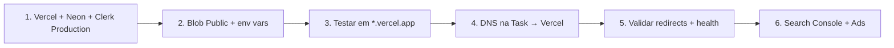

# Go-live — subir o site no domínio oficial

Guia passo a passo para colocar a landing Next.js no ar em **`acessoequipamentos.com.br`**, saindo do site atual hospedado na **Task**.

> **Resumo da situação:** o domínio foi comprado no **[Registro.br](https://registro.br)** (titular, renovação, contatos), mas o **DNS e a hospedagem do site antigo** ficam no painel da **Task** (`ns2.task.com.br`, `ns3.task.com.br`, `ns4.task.com.br`). Para o site novo, você **não muda o registrador** — só altera os **registros DNS na Task** para apontar para a **Vercel**.

Checklist operacional complementar: [PASSOS-MANUAIS.md](./PASSOS-MANUAIS.md) · Deploy preview: [DEPLOY-PREVIEW-VERCEL.md](./DEPLOY-PREVIEW-VERCEL.md)

---

## Visão geral (ordem correta)



**Não inverta:** configure Clerk **Production** e variáveis na Vercel **antes** de mudar o DNS. Se mudar o DNS primeiro, visitantes podem cair num site sem login admin ou sem banco.

---

## Parte A — O que é cada serviço

| Serviço | Função | Onde configurar |
|---------|--------|-----------------|
| **Registro.br** | Dono do domínio `.com.br` | [registro.br](https://registro.br) — renovação, e-mail do titular |
| **Task** | DNS + site WordPress **atual** | Painel Task (hospedagem legada) |
| **Vercel** | Hospedagem do site **novo** (Next.js) | [vercel.com](https://vercel.com) → projeto `Landing_Page_Acesso` |
| **Neon** | Banco Postgres (leads, equipamentos, blog) | [console.neon.tech](https://console.neon.tech) |
| **Clerk** | Login do painel `/dashboard` | [dashboard.clerk.com](https://dashboard.clerk.com) |
| **Vercel Blob** | Fotos do catálogo e mídia do blog | Vercel → Storage → store **Public** |

---

## Parte B — Antes de tocar no DNS (fazer na Vercel)

### B.1 Variáveis de ambiente (Production)

**Vercel → projeto → Settings → Environment Variables → Production**

| Variável | Obrigatória | Valor / nota |
|----------|-------------|--------------|
| `DATABASE_URL` | Sim | Neon **pooler** (`…-pooler…neon.tech?sslmode=require`) |
| `CLERK_SECRET_KEY` | Sim | `sk_live_…` (instância **Production** do Clerk) |
| `NEXT_PUBLIC_CLERK_PUBLISHABLE_KEY` | Sim | `pk_live_…` |
| `NEXT_PUBLIC_APP_URL` | Sim | `https://acessoequipamentos.com.br` (já com domínio oficial) |
| `BLOB_STORE_ID` | Sim | ID do store **Public** (`store_…`) |
| `BLOB_ACCESS` | Sim | `public` |
| `RESEND_API_KEY` | E-mail leads | Após verificar domínio no Resend |
| `RESEND_FROM_EMAIL` | E-mail leads | ex.: `comercial@acessoequipamentos.com.br` |
| `LEADS_NOTIFY_EMAIL` | E-mail leads | Caixa que recebe orçamentos |
| `ARCJET_KEY` | Recomendado | Rate limit do formulário |
| `NEXT_PUBLIC_GA_MEASUREMENT_ID` | Ads/GA4 | Ver [GOOGLE-ADS-GA4.md](./GOOGLE-ADS-GA4.md) |

**Depois de salvar:** Deployments → último deploy → **Redeploy** (env só entra em vigor após novo deploy).

**Erro comum:** `Please provide required params for Postgres driver: url: ''` → falta `DATABASE_URL` no ambiente de **Build**.

### B.2 Clerk Production (painel admin)

1. [Clerk Dashboard](https://dashboard.clerk.com) → instância **Production**
2. Copie `pk_live_` e `sk_live_` → cole na Vercel (passo B.1)
3. **Domains** → adicione `acessoequipamentos.com.br` (e `www` se usar)
4. Convide usuários admin/comercial com metadata `{ "role": "admin" }` ou `"comercial"`
5. Guia completo: [CLERK-ACESSO-ADMIN.md](./CLERK-ACESSO-ADMIN.md)

### B.3 Blob Public (fotos e vídeos do blog)

1. Vercel → **Storage** → Blob → store **Public** (ex.: `landing-page-acesso-blob-public`)
2. Conecte ao projeto → confira `BLOB_STORE_ID` em Production
3. `BLOB_ACCESS=public`
4. **Desconecte** store Private se ainda estiver ligado (causa erro de upload)

### B.4 Testar antes do DNS

Com o site ainda em `https://SEU-PROJETO.vercel.app`:

- [ ] `/orcamento` envia lead (dashboard `/dashboard/leads`)
- [ ] `/sign-in` com usuário admin
- [ ] `/dashboard/equipamentos` e `/dashboard/dicas` funcionam
- [ ] Upload de foto no equipamento e imagem/vídeo no blog
- [ ] `GET https://SEU-PROJETO.vercel.app/api/health` → `"ok": true`

Checklist de preview: [PREVIEW-VALIDACAO.md](./PREVIEW-VALIDACAO.md)

---

## Parte C — DNS: Registro.br vs Task

### C.1 Registro.br (só conferir)

1. Acesse [registro.br](https://registro.br) com login do titular
2. Confirme que `acessoequipamentos.com.br` está **ativo** e com contato válido
3. Em **DNS** ou **Servidores DNS**, verifique se apontam para a Task, por exemplo:
   - `ns2.task.com.br`
   - `ns3.task.com.br`
   - `ns4.task.com.br`

> **Se os nameservers forem da Task**, todas as alterações de A, CNAME e TXT são feitas no **painel da Task**, não no Registro.br.

### C.2 Adicionar domínio na Vercel

1. Vercel → projeto → **Settings** → **Domains**
2. **Add** → `acessoequipamentos.com.br`
3. **Add** → `www.acessoequipamentos.com.br` (recomendado)
4. A Vercel mostra os registros necessários. Anote:

| Tipo | Nome / host | Valor típico |
|------|-------------|--------------|
| **A** | `@` (raiz) | `76.76.21.21` (IP da Vercel — confira no painel) |
| **CNAME** | `www` | `cname.vercel-dns.com` |

> Os valores exatos aparecem na Vercel no momento do cadastro. Use **sempre** o que o painel mostrar.

### C.3 Alterar DNS no painel Task

1. Entre no painel da **Task** (hospedagem do site atual)
2. Abra **DNS** / **Zona DNS** do domínio `acessoequipamentos.com.br`
3. **Remova ou edite** registros antigos que apontam para o servidor WordPress:
   - Registros **A** da raiz (`@`) para IP da Task
   - **CNAME** de `www` para o host antigo
4. **Crie** os registros que a Vercel pediu (A na raiz, CNAME no www)
5. **Não apague** registros de e-mail (MX, SPF, DKIM) se a empresa usa e-mail no domínio — só mexa em A/CNAME do site
6. Salve e aguarde propagação (**15 min a 48 h**; em geral &lt; 2 h)

### C.4 Primary domain e redirect www

Na Vercel → Domains:

- Defina `acessoequipamentos.com.br` como **Primary**
- Ative redirect automático: `www` → raiz (ou o contrário, mas escolha um só)

### C.5 Site antigo na Task

Quando o DNS propagar:

- O WordPress na Task **deixa de receber tráfego** pelo domínio principal
- Opcional: no painel Task, desative o site antigo ou configure redirect 301 para o domínio (evita conteúdo duplicado se alguém acessar por IP)
- Os **301 do WordPress** já estão no código novo (`src/data/legacy-redirects.json` + `src/proxy.ts`)

---

## Parte D — Logo após propagar DNS

### D.1 Health check

```bash
curl https://acessoequipamentos.com.br/api/health
```

Esperado:

- `"ok": true`
- `"clerk": { "mode": "live" }` e `"productionMismatch": false`
- `"database": { "connected": true }`

### D.2 Redirects WordPress (crítico para Google Ads)

```bash
curl -I https://acessoequipamentos.com.br/blog/
curl -I https://acessoequipamentos.com.br/plataforma-elevatoria-tesoura-a-solucao-ideal-para-trabalhos-em-altura/
```

Esperado: `HTTP/2 301` com `Location` correto (`/dicas` ou ficha de equipamento).

Testes automatizados:

```bash
npm run test -- src/lib/legacy-redirects.test.ts
npm run test:e2e -- tests/e2e/Legacy.redirects.e2e.ts
```

### D.3 Teste comercial completo

1. Abra `https://acessoequipamentos.com.br/orcamento`
2. Envie orçamento de teste com plataforma (altura + carga no WhatsApp)
3. Confira lead em `/dashboard/leads` e no CRM whatsappOS
4. Confira e-mail interno (Resend), se configurado

### D.4 Google Search Console

1. [search.google.com/search-console](https://search.google.com/search-console) → adicionar propriedade `https://acessoequipamentos.com.br`
2. Validação por **registro TXT** no DNS da **Task** (mesmo painel do passo C.3)
3. Enviar sitemap: `https://acessoequipamentos.com.br/sitemap.xml`
4. Exportar top URLs (90 dias) e comparar com `src/data/legacy-redirects.json`

Detalhes: [MIGRACAO-SEO-WP.md](./MIGRACAO-SEO-WP.md)

### D.5 Google Ads / GA4

- Configurar `NEXT_PUBLIC_GA_MEASUREMENT_ID` na Vercel Production
- Importar conversões no Google Ads
- Guia: [GOOGLE-ADS-GA4.md](./GOOGLE-ADS-GA4.md)

---

## Parte E — Gate técnico (CI e conteúdo)

### CI e qualidade

| Item | Status | Referência |
|------|--------|------------|
| Lint + types + unit no PR | Obrigatório | [CI.md](./CI.md) |
| Build `main` (migrate + E2E) | Após push | `.github/workflows/CI.yml` |
| Orçamento E2E | ✅ | `tests/e2e/Marketing.conversion.e2e.ts` |
| API leads | ✅ | `tests/integration/Leads.api.integ.ts` |

### SEO e migração WordPress

| Item | Status | Referência |
|------|--------|------------|
| Mapa 301 versionado | ✅ | `src/data/legacy-redirects.json` |
| `/blog` → `/dicas` | ✅ | |
| Posts WP → artigos `/dicas` | ✅ | CMS em `/dashboard/dicas` |
| Sitemap com `/dicas` | ✅ | `src/app/sitemap.ts` |
| Top URLs GSC | ⏳ | Exportar e completar JSON antes do corte DNS |

### UX e conteúdo

| Item | Status |
|------|--------|
| 404 com categorias | ✅ |
| Skeleton catálogo | ✅ |
| `/dicas` com editor rico (texto, vídeo, links, botões) | ✅ |
| PageSpeed ≥ 85 mobile | ⏳ medir Lighthouse após deploy |

---

## Parte F — Checklist final (dia do go-live)

Marque na ordem:

- [ ] **Clerk Production** (`pk_live_` / `sk_live_`) na Vercel Production + redeploy
- [ ] **Neon pooler** em `DATABASE_URL`
- [ ] **Blob Public** conectado (`BLOB_STORE_ID`, `BLOB_ACCESS=public`)
- [ ] `NEXT_PUBLIC_APP_URL=https://acessoequipamentos.com.br`
- [ ] Domínios adicionados na Vercel (raiz + www)
- [ ] **DNS alterado na Task** (A + CNAME conforme Vercel)
- [ ] Propagação OK — domínio **Valid** na Vercel
- [ ] `curl /api/health` → ok + Clerk live
- [ ] Redirects WP testados (`curl -I` nas top URLs)
- [ ] Orçamento + dashboard + CRM testados em produção
- [ ] Search Console: propriedade + sitemap
- [ ] TXT de verificação Google na Task (se ainda não feito)
- [ ] Equipe com acesso admin convidada no Clerk Production
- [ ] Site WordPress na Task desativado ou com redirect (opcional)

---

## Parte G — Problemas comuns

| Sintoma | Causa provável | Solução |
|---------|----------------|---------|
| Site antigo ainda aparece | DNS não propagou ou A antigo na Task | Aguardar; limpar cache DNS; revisar zona DNS na Task |
| Upload de imagem falha | Blob Private conectado | Usar store **Public**; redeploy |
| Admin não loga | Clerk ainda em `pk_test_` em Production | Trocar para `pk_live_` / `sk_live_` |
| 404 em URLs antigas do WP | Falta entrada em `legacy-redirects.json` | Adicionar 301 e redeploy |
| Build falha sem banco | `DATABASE_URL` ausente no Build | Colocar env em Production na Vercel |
| E-mail de lead não chega | Resend sem domínio verificado | TXT/CNAME do Resend na Task |

---

## Referências rápidas

| Documento | Conteúdo |
|-----------|----------|
| [PASSOS-MANUAIS.md](./PASSOS-MANUAIS.md) | CRM, Resend, logos, rotina pós-go-live |
| [DEPLOY-PREVIEW-VERCEL.md](./DEPLOY-PREVIEW-VERCEL.md) | Deploy em `*.vercel.app` sem domínio |
| [CLERK-ACESSO-ADMIN.md](./CLERK-ACESSO-ADMIN.md) | Roles e convites |
| [MIGRACAO-SEO-WP.md](./MIGRACAO-SEO-WP.md) | SEO pós-WordPress |
| [GOOGLE-ADS-GA4.md](./GOOGLE-ADS-GA4.md) | Analytics e conversões |

**Domínio:** `acessoequipamentos.com.br` · **Registro:** Registro.br · **DNS atual:** Task · **Hospedagem nova:** Vercel
